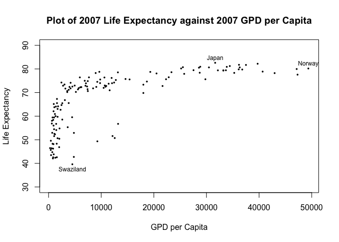
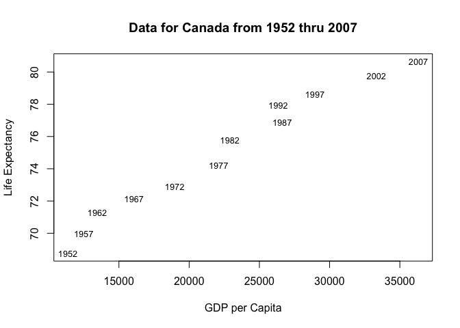

Exploration of gapminder
================
Dan Hadley
9/17/2019

-   [1. Introduction](#introduction)
-   [2. Overview](#overview)
-   [3. Analysis](#analysis)

1. Introduction
---------------

We explore the gapminder dataset available in the gapminder package. All analyses are performed using three R packages: [gapminder](https://cran.r-project.org/web/packages/gapminder/index.html), [tibble](https://cran.r-project.org/web/packages/tibble/index.html), [DT](https://cran.r-project.org/web/packages/DT/index.html).

In the first code chunk, excluded from the document, we set the file path for the plots rendered by R Markdown and load the above packages and `knitr` using the `library` command.

2. Overview
-----------

To get a feel for the gapminder dataset, we can view the first 6 rows using the `head()` function.

``` r
head(gapminder)
```

    ## # A tibble: 6 x 6
    ##   country     continent  year lifeExp      pop gdpPercap
    ##   <fct>       <fct>     <int>   <dbl>    <int>     <dbl>
    ## 1 Afghanistan Asia       1952    28.8  8425333      779.
    ## 2 Afghanistan Asia       1957    30.3  9240934      821.
    ## 3 Afghanistan Asia       1962    32.0 10267083      853.
    ## 4 Afghanistan Asia       1967    34.0 11537966      836.
    ## 5 Afghanistan Asia       1972    36.1 13079460      740.
    ## 6 Afghanistan Asia       1977    38.4 14880372      786.

We see that this function produces a 6 row and 6 column object called a tibble. The dataset contains information on the life expectancy (in years), population, and GPD per capita (US$, inflation-adjusted) for 142 countries from 1952 to 2007 measured every 5 years.

3. Analysis
-----------

To get a feel for the dataset, the `summary()` function calclulates the minimum, 3rd quartile, median, mean, 1st quartile, and maximum value for all numeric columns. Columns with character data, often saved as the factor data type in `R`, performs counts on the unique character entries.

``` r
(summ.gap <- summary(gapminder)) #Surrounding with () declares variable and prints value(s)
```

    ##         country        continent        year         lifeExp     
    ##  Afghanistan:  12   Africa  :624   Min.   :1952   Min.   :23.60  
    ##  Albania    :  12   Americas:300   1st Qu.:1966   1st Qu.:48.20  
    ##  Algeria    :  12   Asia    :396   Median :1980   Median :60.71  
    ##  Angola     :  12   Europe  :360   Mean   :1980   Mean   :59.47  
    ##  Argentina  :  12   Oceania : 24   3rd Qu.:1993   3rd Qu.:70.85  
    ##  Australia  :  12                  Max.   :2007   Max.   :82.60  
    ##  (Other)    :1632                                                
    ##       pop              gdpPercap       
    ##  Min.   :6.001e+04   Min.   :   241.2  
    ##  1st Qu.:2.794e+06   1st Qu.:  1202.1  
    ##  Median :7.024e+06   Median :  3531.8  
    ##  Mean   :2.960e+07   Mean   :  7215.3  
    ##  3rd Qu.:1.959e+07   3rd Qu.:  9325.5  
    ##  Max.   :1.319e+09   Max.   :113523.1  
    ## 

``` r
cnt <- aggregate(gapminder, by=list(gapminder$continent), length) #counts observations by continent
```

We see that Africa is the most represented continent with 624 observations, which has 276 more observations than the next most represented continent, Asia. For numerical data, `summary()` presents a quick snapshot of its distribution. For example, we see that GDP per capita ranges from 24 years to 624 and the mean (NA) is twice as large as the median (). Thus, the GPD per capita data has a large positive skew.

Suppose we are interested in the relationship between Life Expectancy and GDP per capita. We plot life expectancy against GDP per capita for all 142 countries where the most recent year's data, 2007, is available.

``` r
dat <- gapminder[gapminder$year == max(gapminder$year), c(1, 4, 6)]

plot(dat$gdpPercap, dat$lifeExp, pch=16, cex=0.5,
     xlab="GPD per Capita", ylab="Life Expectancy",
     main='Plot of 2007 Life Expectancy against 2007 GPD per Capita',
     ylim=c(30, 90))
text(x=dat$gdpPercap[which.max(dat$lifeExp)], y=max(dat$lifeExp)+2,
     labels=dat$country[which.max(dat$lifeExp)], cex=0.75)
text(x=max(dat$gdpPercap), y=dat$lifeExp[which.max(dat$gdpPercap)]+2,
     labels=dat$country[which.max(dat$gdpPercap)], cex=0.75)
text(x=dat$gdpPercap[which.min(dat$lifeExp)], y=min(dat$lifeExp)-2,
     labels=dat$country[which.min(dat$lifeExp)], cex=0.75)
```



We see from the plot that Japan had the highest life expectancy in 2007 at 82.6 years and Norway had the highest GDP per capita in 2007 at US$49357.19. Meanwhile, Swaziland had the lowest life expectancy in 2007 at 39.6 years. The result is a data set with 1704 observations.

If we are interested in Canada specifically, we can limit our analysis to just one country. Suppose we want to plot life expectancy against GDP per capita for Canada from 1952 to 2007. In order to add the third dimension of time, the plot symbols are the years of the observations.

``` r
can <- gapminder[gapminder$country=='Canada',] #Subset gapminder dataset to Canada's observations

# Plot with year as plot symbol
plot(can$gdpPercap, can$lifeExp, type='n',
     xlab="GPD per Capita", ylab="Life Expectancy",
     main="Data for Canada from 1952 thru 2007")
text(can$gdpPercap, can$lifeExp, labels=can$year, cex=0.8)
```


