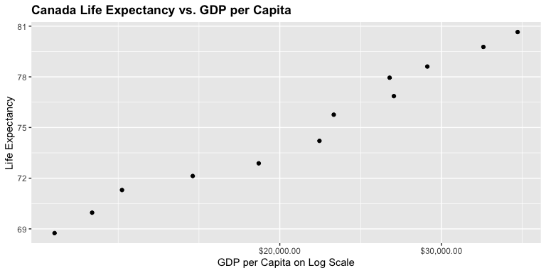
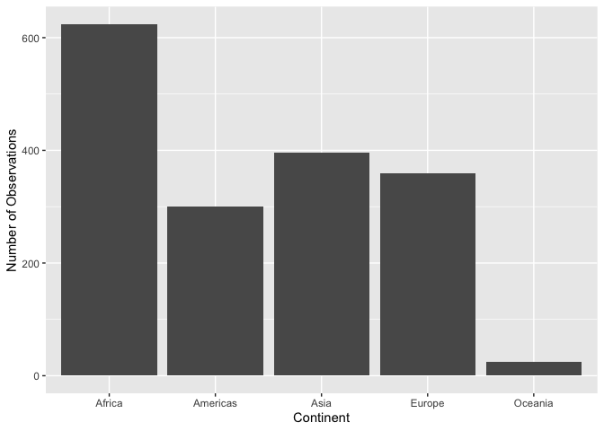
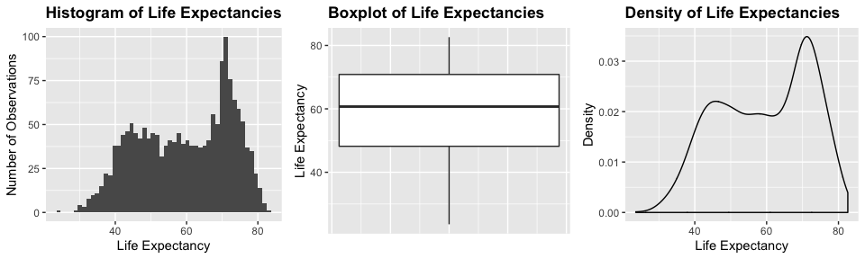
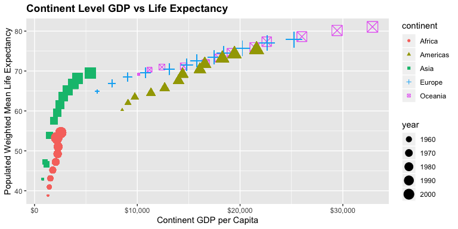
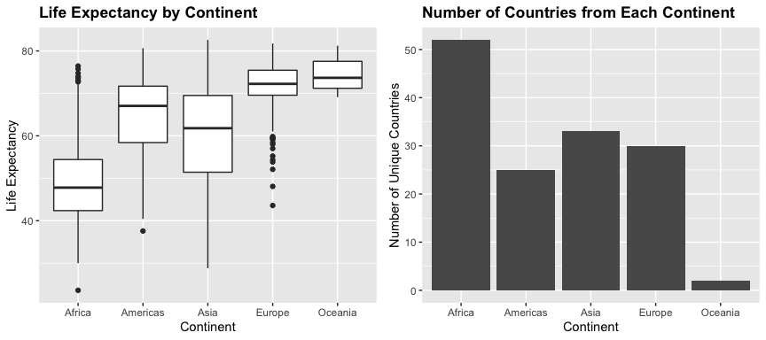

<!---The following chunk allows errors when knitting--->


**Optional, but recommended startup**:

1. Change the file output to both html and md _documents_ (not notebook).

2. `knit` the document. 

3. Stage and commit the rmd, and knitted documents.

# Intro to `dplyr` syntax

Load the `gapminder` and `tidyverse` packages. Hint: `suppressPackageStartupMessages()`!
    - This loads `dplyr`, too.

<!---The following chunk loads the appropriate libraries--->


    
# Question 1

## 1.1 Subset to Three Countries in the 1970's

<!---The following chunk finds the first year of observations for the 70's and the top 3 countries by population for that year--->


Using the `filter()` function from the `dplyr` package, we filter the gapminder data to all observations for three countries in the 1970's.  To pick which three countries, we choose countries with the largest populations as of 1972: China, India, United States.


```r
## Create data with 3 countries' observations in the 1970's based on largest populations from first 1970's observation
(gap.3 <- gapminder %>% 
   filter(year > 1969,
          year < 1980,
          country %in% ctries))
```

```
## # A tibble: 6 x 6
##   country       continent  year lifeExp       pop gdpPercap
##   <fct>         <fct>     <int>   <dbl>     <int>     <dbl>
## 1 China         Asia       1972    63.1 862030000      677.
## 2 China         Asia       1977    64.0 943455000      741.
## 3 India         Asia       1972    50.7 567000000      724.
## 4 India         Asia       1977    54.2 634000000      813.
## 5 United States Americas   1972    71.3 209896000    21806.
## 6 United States Americas   1977    73.4 220239000    24073.
```

## 1.2 Use Pipe Operator to Select Country and GDP per Capita:

The `select()` function from the `dplyr` package makes it very easy to choose which columns to display from a dataset.


```r
## Select country and gdpPercap columns from filtered dataset
gap.3 %>% 
  select(country, gdpPercap)
```

```
## # A tibble: 6 x 2
##   country       gdpPercap
##   <fct>             <dbl>
## 1 China              677.
## 2 China              741.
## 3 India              724.
## 4 India              813.
## 5 United States    21806.
## 6 United States    24073.
```

## 1.3 Filter `gapminder` to observations with drop in Life Expectancy:

First, we can use the `mutate()` function to add a column to the `gapminder` dataset that calculates the 5-year change in life expectancy, in years, for each country.  This column is named `changeinlifeExp`.  For each country's first year observation, the change is 0.  Using this new column, we can filter out observations whose 5-year life expectancy change is negative.  When displaying the negative life expectancy changes, the change values are rounded to two decimal places.  Thus, a change that displays `0` is actually a negative change smaller than `-0.005`.


```r
gapminder %>% 
  group_by(country) %>% 
  mutate(changeinlifeExp = c(0, diff(lifeExp, lag=1))) %>% 
  filter(changeinlifeExp < 0) %>% 
  mutate(changeinlifeExp = round(changeinlifeExp, 2)) %>% #round change to 2 digits
  datatable()
```

<!--html_preserve--><div id="htmlwidget-9a5e1b9e53c288ab6c3b" style="width:100%;height:auto;" class="datatables html-widget"></div>
<script type="application/json" data-for="htmlwidget-9a5e1b9e53c288ab6c3b">{"x":{"filter":"none","data":[["1","2","3","4","5","6","7","8","9","10","11","12","13","14","15","16","17","18","19","20","21","22","23","24","25","26","27","28","29","30","31","32","33","34","35","36","37","38","39","40","41","42","43","44","45","46","47","48","49","50","51","52","53","54","55","56","57","58","59","60","61","62","63","64","65","66","67","68","69","70","71","72","73","74","75","76","77","78","79","80","81","82","83","84","85","86","87","88","89","90","91","92","93","94","95","96","97","98","99","100","101","102"],["Albania","Angola","Benin","Botswana","Botswana","Botswana","Bulgaria","Bulgaria","Bulgaria","Burundi","Cambodia","Cambodia","Cameroon","Cameroon","Cameroon","Central African Republic","Central African Republic","Central African Republic","Chad","Chad","China","Congo, Dem. Rep.","Congo, Dem. Rep.","Congo, Dem. Rep.","Congo, Dem. Rep.","Congo, Rep.","Congo, Rep.","Cote d'Ivoire","Cote d'Ivoire","Cote d'Ivoire","Croatia","Czech Republic","Denmark","El Salvador","El Salvador","Eritrea","Gabon","Gabon","Gabon","Ghana","Hungary","Hungary","Iraq","Iraq","Iraq","Jamaica","Jamaica","Kenya","Kenya","Kenya","Korea, Dem. Rep.","Korea, Dem. Rep.","Korea, Dem. Rep.","Lesotho","Lesotho","Lesotho","Liberia","Malawi","Malawi","Montenegro","Mozambique","Mozambique","Myanmar","Namibia","Namibia","Netherlands","Nigeria","Nigeria","Norway","Poland","Poland","Puerto Rico","Romania","Romania","Rwanda","Rwanda","Serbia","Sierra Leone","Slovak Republic","Somalia","South Africa","South Africa","South Africa","Swaziland","Swaziland","Swaziland","Tanzania","Tanzania","Togo","Trinidad and Tobago","Trinidad and Tobago","Uganda","Uganda","Uganda","Uganda","Zambia","Zambia","Zambia","Zambia","Zimbabwe","Zimbabwe","Zimbabwe"],["Europe","Africa","Africa","Africa","Africa","Africa","Europe","Europe","Europe","Africa","Asia","Asia","Africa","Africa","Africa","Africa","Africa","Africa","Africa","Africa","Asia","Africa","Africa","Africa","Africa","Africa","Africa","Africa","Africa","Africa","Europe","Europe","Europe","Americas","Americas","Africa","Africa","Africa","Africa","Africa","Europe","Europe","Asia","Asia","Asia","Americas","Americas","Africa","Africa","Africa","Asia","Asia","Asia","Africa","Africa","Africa","Africa","Africa","Africa","Europe","Africa","Africa","Asia","Africa","Africa","Europe","Africa","Africa","Europe","Europe","Europe","Americas","Europe","Europe","Africa","Africa","Europe","Africa","Europe","Africa","Africa","Africa","Africa","Africa","Africa","Africa","Africa","Africa","Africa","Americas","Americas","Africa","Africa","Africa","Africa","Africa","Africa","Africa","Africa","Africa","Africa","Africa"],[1992,1987,2002,1992,1997,2002,1977,1992,1997,1992,1972,1977,1992,1997,2002,1992,1997,2002,1997,2002,1962,1982,1987,1992,1997,1992,1997,1992,1997,2002,1982,1972,1982,1977,1982,1982,1997,2002,2007,2002,1982,1992,1992,1997,2002,1992,2002,1992,1997,2002,1992,1997,2002,1997,2002,2007,1992,1997,2002,2002,2002,2007,2002,1997,2002,1972,1997,2002,1987,1977,1987,1992,1987,1992,1987,1992,1982,1992,1972,1992,1997,2002,2007,1997,2002,2007,1992,1997,2002,1997,2002,1977,1982,1992,1997,1987,1992,1997,2002,1992,1997,2002],[71.581,39.906,54.406,62.745,52.556,46.634,70.81,71.19,70.32,44.736,40.317,31.22,54.314,52.199,49.856,49.396,46.066,43.308,51.573,50.525,44.50136,47.784,47.412,45.548,42.587,56.433,52.962,52.044,47.991,46.832,70.46,70.29,74.63,56.696,56.604,43.89,60.461,56.761,56.735,58.453,69.39,69.17,59.461,58.811,57.046,71.766,72.047,59.285,54.407,50.992,69.978,67.727,66.662,55.558,44.593,42.592,40.802,47.495,45.009,73.981,44.026,42.082,59.908,58.909,51.479,73.75,47.464,46.608,75.89,70.67,70.98,73.911,69.53,69.36,44.02,23.599,70.162,38.333,70.35,39.658,60.236,53.365,49.339,54.289,43.869,39.613,50.44,48.466,57.561,69.465,68.976,50.35,49.849,48.825,44.578,50.821,46.1,40.238,39.193,60.377,46.809,39.989],[3326498,7874230,7026113,1342614,1536536,1630347,8797022,8658506,8066057,5809236,7450606,6978607,12467171,14195809,15929988,3265124,3696513,4048013,7562011,8835739,665770000,30646495,35481645,41672143,47798986,2409073,2800947,12772596,14625967,16252726,4413368,9862158,5117810,4282586,4474873,2637297,1126189,1299304,1454867,20550751,10705535,10348684,17861905,20775703,24001816,2378618,2664659,25020539,28263827,31386842,20711375,21585105,22215365,1982823,2046772,2012649,1912974,10419991,11824495,720230,18473780,19951656,45598081,1774766,1972153,13329874,106207839,119901274,4186147,34621254,37740710,3585176,22686371,22797027,6349365,7290203,9032824,4260884,4593433,6099799,42835005,44433622,43997828,1054486,1130269,1133066,26605473,30686889,4977378,1138101,1101832,11457758,12939400,18252190,21210254,7272406,8381163,9417789,10595811,10704340,11404948,11926563],[2497.437901,2430.208311,1372.877931,7954.111645,8647.142313,11003.60508,7612.240438,6302.623438,5970.38876,631.6998778,421.6240257,524.9721832,1793.163278,1694.337469,1934.011449,747.9055252,740.5063317,738.6906068,1004.961353,1156.18186,487.6740183,673.7478181,672.774812,457.7191807,312.188423,4016.239529,3484.164376,1648.073791,1786.265407,1648.800823,13221.82184,13108.4536,21688.04048,5138.922374,4098.344175,524.8758493,14722.84188,12521.71392,13206.48452,1111.984578,12545.99066,10535.62855,3745.640687,3076.239795,4390.717312,7404.923685,6994.774861,1341.921721,1360.485021,1287.514732,3726.063507,1690.756814,1646.758151,1186.147994,1275.184575,1569.331442,636.6229191,692.2758103,665.4231186,6557.194282,633.6179466,823.6856205,611,3899.52426,4072.324751,18794.74567,1624.941275,1615.286395,31540.9748,9508.141454,9082.351172,14641.58711,9696.273295,6598.409903,847.991217,737.0685949,15181.0927,1068.696278,9674.167626,926.9602964,7479.188244,7710.946444,9269.657808,3876.76846,4128.116943,4513.480643,825.682454,789.1862231,886.2205765,8792.573126,11460.60023,843.7331372,682.2662268,644.1707969,816.559081,1213.315116,1210.884633,1071.353818,1071.613938,693.4207856,792.4499603,672.0386227],[-0.42,-0.04,-0.37,-0.88,-10.19,-5.92,-0.09,-0.15,-0.87,-3.48,-5.1,-9.1,-0.67,-2.12,-2.34,-1.09,-3.33,-2.76,-0.15,-1.05,-6.05,-0.02,-0.37,-1.86,-2.96,-1.04,-3.47,-2.61,-4.05,-1.16,-0.18,-0.09,-0.06,-1.51,-0.09,-0.64,-0.91,-3.7,-0.03,-0.1,-0.56,-0.41,-5.58,-0.65,-1.77,-0,-0.22,-0.05,-4.88,-3.41,-0.67,-2.25,-1.06,-4.13,-10.96,-2,-5.23,-1.93,-2.49,-1.46,-2.32,-1.94,-0.42,-3.09,-7.43,-0.07,-0.01,-0.86,-0.08,-0.18,-0.34,-0.72,-0.13,-0.17,-2.2,-20.42,-0.14,-1.67,-0.63,-4.84,-1.65,-6.87,-4.03,-4.18,-10.42,-4.26,-1.09,-1.97,-0.83,-0.4,-0.49,-0.67,-0.5,-2.68,-4.25,-1,-4.72,-5.86,-1.05,-1.97,-13.57,-6.82]],"container":"<table class=\"display\">\n  <thead>\n    <tr>\n      <th> <\/th>\n      <th>country<\/th>\n      <th>continent<\/th>\n      <th>year<\/th>\n      <th>lifeExp<\/th>\n      <th>pop<\/th>\n      <th>gdpPercap<\/th>\n      <th>changeinlifeExp<\/th>\n    <\/tr>\n  <\/thead>\n<\/table>","options":{"columnDefs":[{"className":"dt-right","targets":[3,4,5,6,7]},{"orderable":false,"targets":0}],"order":[],"autoWidth":false,"orderClasses":false}},"evals":[],"jsHooks":[]}</script><!--/html_preserve-->

## 1.4 Show maximum Country GDP per Capita for each Country


```r
gapminder %>% 
  group_by(country) %>% 
  summarise(maxgdp = round(max(gdpPercap), 2)) %>%
  datatable()
```

<!--html_preserve--><div id="htmlwidget-c6f8f9d42bb529ddf1ad" style="width:100%;height:auto;" class="datatables html-widget"></div>
<script type="application/json" data-for="htmlwidget-c6f8f9d42bb529ddf1ad">{"x":{"filter":"none","data":[["1","2","3","4","5","6","7","8","9","10","11","12","13","14","15","16","17","18","19","20","21","22","23","24","25","26","27","28","29","30","31","32","33","34","35","36","37","38","39","40","41","42","43","44","45","46","47","48","49","50","51","52","53","54","55","56","57","58","59","60","61","62","63","64","65","66","67","68","69","70","71","72","73","74","75","76","77","78","79","80","81","82","83","84","85","86","87","88","89","90","91","92","93","94","95","96","97","98","99","100","101","102","103","104","105","106","107","108","109","110","111","112","113","114","115","116","117","118","119","120","121","122","123","124","125","126","127","128","129","130","131","132","133","134","135","136","137","138","139","140","141","142"],["Afghanistan","Albania","Algeria","Angola","Argentina","Australia","Austria","Bahrain","Bangladesh","Belgium","Benin","Bolivia","Bosnia and Herzegovina","Botswana","Brazil","Bulgaria","Burkina Faso","Burundi","Cambodia","Cameroon","Canada","Central African Republic","Chad","Chile","China","Colombia","Comoros","Congo, Dem. Rep.","Congo, Rep.","Costa Rica","Cote d'Ivoire","Croatia","Cuba","Czech Republic","Denmark","Djibouti","Dominican Republic","Ecuador","Egypt","El Salvador","Equatorial Guinea","Eritrea","Ethiopia","Finland","France","Gabon","Gambia","Germany","Ghana","Greece","Guatemala","Guinea","Guinea-Bissau","Haiti","Honduras","Hong Kong, China","Hungary","Iceland","India","Indonesia","Iran","Iraq","Ireland","Israel","Italy","Jamaica","Japan","Jordan","Kenya","Korea, Dem. Rep.","Korea, Rep.","Kuwait","Lebanon","Lesotho","Liberia","Libya","Madagascar","Malawi","Malaysia","Mali","Mauritania","Mauritius","Mexico","Mongolia","Montenegro","Morocco","Mozambique","Myanmar","Namibia","Nepal","Netherlands","New Zealand","Nicaragua","Niger","Nigeria","Norway","Oman","Pakistan","Panama","Paraguay","Peru","Philippines","Poland","Portugal","Puerto Rico","Reunion","Romania","Rwanda","Sao Tome and Principe","Saudi Arabia","Senegal","Serbia","Sierra Leone","Singapore","Slovak Republic","Slovenia","Somalia","South Africa","Spain","Sri Lanka","Sudan","Swaziland","Sweden","Switzerland","Syria","Taiwan","Tanzania","Thailand","Togo","Trinidad and Tobago","Tunisia","Turkey","Uganda","United Kingdom","United States","Uruguay","Venezuela","Vietnam","West Bank and Gaza","Yemen, Rep.","Zambia","Zimbabwe"],[978.01,5937.03,6223.37,5522.78,12779.38,34435.37,36126.49,29796.05,1391.25,33692.61,1441.28,3822.14,7446.3,12569.85,9065.8,10680.79,1217.03,631.7,1713.78,2602.66,36319.24,1193.07,1704.06,13171.64,4959.11,7006.58,1937.58,905.86,4879.51,9645.06,2602.71,14619.22,8948.1,22833.31,35278.42,3694.21,6025.37,7429.46,5581.18,5728.35,12154.09,913.47,690.81,33207.08,30470.02,21745.57,884.76,32170.37,1327.61,27538.41,5186.05,945.58,838.12,2011.16,3548.33,39724.98,18008.94,36180.79,2452.21,3540.65,11888.6,14688.24,40676,25523.28,28569.72,7433.89,31656.07,4519.46,1463.25,4106.53,23348.14,113523.13,10461.06,1569.33,803.01,21951.21,1748.56,759.35,12451.66,1042.58,1803.15,10956.99,11977.57,3095.77,11732.51,3820.18,823.69,944,4811.06,1091.36,36797.93,25185.01,5486.37,1054.38,2013.98,49357.19,22316.19,2605.95,9809.19,4258.5,7408.91,3190.48,15389.92,20509.65,19328.71,7670.12,10808.48,881.57,1890.22,34167.76,1712.47,15870.88,1465.01,47143.18,18678.31,25768.26,1450.99,9269.66,28821.06,3970.1,2602.39,4513.48,33859.75,37506.42,4184.55,28718.28,1107.48,7458.4,1649.66,18008.51,7092.92,8458.28,1056.38,33203.26,42951.65,10611.46,13143.95,2441.58,7110.67,2280.77,1777.08,799.36]],"container":"<table class=\"display\">\n  <thead>\n    <tr>\n      <th> <\/th>\n      <th>country<\/th>\n      <th>maxgdp<\/th>\n    <\/tr>\n  <\/thead>\n<\/table>","options":{"columnDefs":[{"className":"dt-right","targets":2},{"orderable":false,"targets":0}],"order":[],"autoWidth":false,"orderClasses":false}},"evals":[],"jsHooks":[]}</script><!--/html_preserve-->

## 1.5 Scatterplot of Canada's Life Expectancy vs. GDP per Capita


```r
gapminder %>% 
  filter(country == 'Canada') %>% 
  ggplot(aes(gdpPercap, lifeExp)) +
  geom_point() + 
  ggtitle('Canada') + 
  scale_x_log10('GDP per Capita', labels=scales::dollar_format()) + 
  ylab('Life Expectancy')
```

<!-- -->

# Question 2

We analyze the `continent` categorical variable, listing the continent for each observation, and the `lifeExp` quantitative varible, which gives each observation's life expectancy in years.

A bar plot for continent shows the possible values of the `continent` variable as well as giving a sense of the spread of the observations by showing which continents are most/least observed, etc.


```r
ggplot(gapminder, aes(continent)) + 
  geom_bar() + 
  ggtitle('Count of Observations by Continent') + 
  theme(plot.title = element_text(color='black', face="bold")) + 
  ylab('Number of Observations') +
  xlab('Continent')
```

<!-- -->

For life expectancy, 

```r
plot1 <- ggplot(gapminder, aes(lifeExp)) + 
  geom_histogram(bins=50) + 
  ggtitle('Histogram of Life Expectancies') + 
  xlab('Life Expectancy') + 
  ylab('Number of Observations') + 
  theme(plot.title = element_text(color='black', face="bold"))

plot2 <- ggplot(gapminder, aes(y=lifeExp)) + 
  geom_boxplot() + 
  ggtitle('Boxplot of Life Expectancies') + 
  ylab('Life Expectancy') + 
  xlab('') + 
  theme(plot.title = element_text(color='black', face="bold"), 
        axis.text.x=element_blank(),
        axis.ticks.x=element_blank())

plot3 <- ggplot(gapminder, aes(lifeExp)) + 
  geom_density() + 
  ggtitle('Density of Life Expectancies') + 
  ylab('Density') + 
  xlab('Life Expectancy') + 
  theme(plot.title = element_text(color='black', face="bold"))

grid.arrange(plot1, plot2, plot3, nrow=1, ncol=3)
```

<!-- -->

```r
summ.le <- summary(gapminder$lifeExp)
names(summ.le) <- c('Minimum', 'First Quartile', 'Median', 'Mean', 'Third Quartile', 'Maximum')
summ.le <- data.frame(rbind(round(summ.le, 2)), row.names = 'Life Expectancy')
kable(summ.le)
```

                   Minimum   First.Quartile   Median    Mean   Third.Quartile   Maximum
----------------  --------  ---------------  -------  ------  ---------------  --------
Life Expectancy       23.6             48.2    60.71   59.47            70.85      82.6

# Question 3

We now make two plots with some value for anlaysis.  The first plot is a scatterplot of GDP per capita by continent versus population-weighted mean life expectancy.  To calculate GDP per capita, we multiply each country in a continent by its popuSince we took a look at both continent and life expectancy in Question 2, we may want to view life expectancies by continent.  In order to compare the distribution of life expectancies across continents, we look at a boxplot.


```r
## Population by Continent/Year
gapminder %>% 
  group_by(continent, year) %>% 
  mutate(wgt.lifeExp=weighted.mean(lifeExp, w=pop)) %>% 
  mutate(tot.pop=as.numeric(sum(pop)), tot.gdp=as.numeric(sum(pop*gdpPercap))) %>%  #as.numeric() needed for precision
  mutate(tot.gdpPer=round(tot.gdp/tot.pop, 2)) %>% #GDP per capita by continent
  ggplot(aes(x=tot.gdpPer, y=wgt.lifeExp)) + 
  geom_point(aes(shape=continent, color=continent, size=year)) + 
  scale_x_continuous('Continent GDP per Capita', labels=scales::dollar_format()) + 
  ylab('Populated Weighted Mean Life Expectancy') + 
  ggtitle('Continent Level GDP vs Life Expectancy') + 
  theme(plot.title = element_text(color='black', face="bold"))
```

<!-- -->


```r
plot1 <- ggplot(gapminder, aes(x=continent, y=lifeExp)) + 
  geom_boxplot() + 
  xlab('Continent') + 
  ylab('Life Expectancy') + 
  ggtitle('Life Expectancy by Continent') + 
  theme(plot.title = element_text(color='black', face="bold"))

plot2 <- gapminder %>% 
  group_by(continent) %>% 
  mutate(Result=n_distinct(country)) %>% 
  select(continent, Result) %>% 
  unique() %>% 
  ggplot(aes(x=continent, y=Result)) +
  geom_col() +
  ggtitle('Number of Countries from Each Continent') + 
  ylab('Number of Unique Countries') +
  xlab('Continent') + 
  theme(plot.title = element_text(color='black', face="bold"))

grid.arrange(plot1, plot2, nrow=1, ncol=2)
```

<!-- -->
