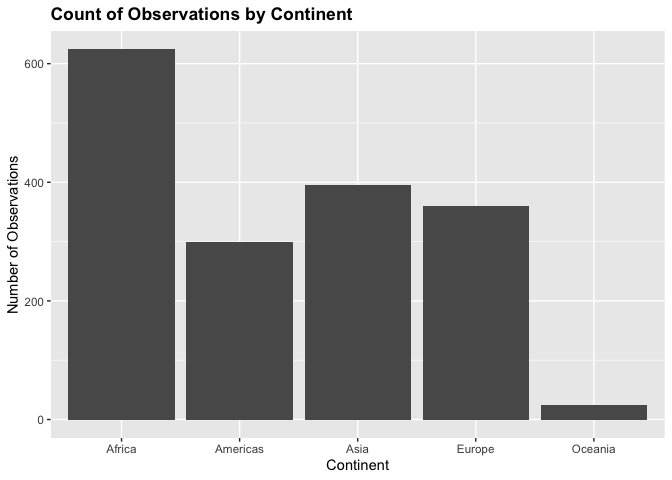

Homework 02
================
Dan Hadley

# Table of Contents
1. [Question 1](#Q1)
    1. [Question 1.1](#Q1.1)
    2. [Question 1.2](#Q1.2)
    3. [Question 1.3](#Q1.3)
    4. [Question 1.4](#Q1.4)
    5. [Question 1.5](#Q1.5)
3. [Question 2](#Q2)
4. [Question 3](#Q3)

<!---The following chunk allows errors when knitting--->

<!---The following chunk loads the appropriate libraries--->

## Question 1 <a name="Q1"></a>

### 1.1 Subset to Three Countries in the 1970’s <a name="Q1.1"></a>

<!---The following chunk finds the first year of observations for the 70's and the top 3 countries by population for that year--->

Using the `filter()` function from the `dplyr` package, we filter the
gapminder data to all observations for three countries in the 1970’s. To
pick which three countries, we choose countries with the largest
populations as of 1972: China, India, United
States.

``` r
## Create data with 3 countries' observations in the 1970's based on largest populations from first 1970's observation
gap.3 <- gapminder %>% 
   filter(year > 1969,
          year < 1980,
          country %in% ctries) 
kable(gap.3, digits=2)
```

| country       | continent | year | lifeExp |       pop | gdpPercap |
| :------------ | :-------- | ---: | ------: | --------: | --------: |
| China         | Asia      | 1972 |   63.12 | 862030000 |    676.90 |
| China         | Asia      | 1977 |   63.97 | 943455000 |    741.24 |
| India         | Asia      | 1972 |   50.65 | 567000000 |    724.03 |
| India         | Asia      | 1977 |   54.21 | 634000000 |    813.34 |
| United States | Americas  | 1972 |   71.34 | 209896000 |  21806.04 |
| United States | Americas  | 1977 |   73.38 | 220239000 |  24072.63 |

### 1.2 Use Pipe Operator to Select Country and GDP per Capita: <a name="Q1.2"></a>

The `select()` function from the `dplyr` package makes it very easy to
choose which columns to display from a dataset. For this question, we
select the “country” and “gdpPercap” columns from the filtered dataset
presented in 1.1.

``` r
## Select country and gdpPercap columns from filtered dataset
gap.3 %>% 
  select(country, gdpPercap) %>% 
  kable(digits=2)
```

| country       | gdpPercap |
| :------------ | --------: |
| China         |    676.90 |
| China         |    741.24 |
| India         |    724.03 |
| India         |    813.34 |
| United States |  21806.04 |
| United States |  24072.63 |

### 1.3 Filter `gapminder` to observations with drop in Life Expectancy: <a name="Q1.3"></a>

We use the `mutate()` function to add a column to the `gapminder`
dataset that calculates the change in life expectancy, in years, for
each observation. This column is named “changeinlifeExp”. For each
country’s first observation, the change is \(0\). Using this new column,
we filter out observations whose life expectancy change is negative.
There are a total of 102 observations meeting this criteria. When
displaying the life expectancy changes for observations with negative
changes, one should note that the values are rounded to two decimal
places and a change that displays \(0\) is actually a negative change
between in the interval \((0, -0.005)\).

``` r
gap.1.3 <- gapminder %>% 
  group_by(country) %>% 
  mutate(changeinlifeExp = c(0, diff(lifeExp, lag=1))) %>% 
  filter(changeinlifeExp < 0) %>% 
  mutate(changeinlifeExp = round(changeinlifeExp, 2)) #round change to 2 digits

kable(gap.1.3[1:10,])
```

| country  | continent | year | lifeExp |     pop |  gdpPercap | changeinlifeExp |
| :------- | :-------- | ---: | ------: | ------: | ---------: | --------------: |
| Albania  | Europe    | 1992 |  71.581 | 3326498 |  2497.4379 |          \-0.42 |
| Angola   | Africa    | 1987 |  39.906 | 7874230 |  2430.2083 |          \-0.04 |
| Benin    | Africa    | 2002 |  54.406 | 7026113 |  1372.8779 |          \-0.37 |
| Botswana | Africa    | 1992 |  62.745 | 1342614 |  7954.1116 |          \-0.88 |
| Botswana | Africa    | 1997 |  52.556 | 1536536 |  8647.1423 |         \-10.19 |
| Botswana | Africa    | 2002 |  46.634 | 1630347 | 11003.6051 |          \-5.92 |
| Bulgaria | Europe    | 1977 |  70.810 | 8797022 |  7612.2404 |          \-0.09 |
| Bulgaria | Europe    | 1992 |  71.190 | 8658506 |  6302.6234 |          \-0.15 |
| Bulgaria | Europe    | 1997 |  70.320 | 8066057 |  5970.3888 |          \-0.87 |
| Burundi  | Africa    | 1992 |  44.736 | 5809236 |   631.6999 |          \-3.48 |

### 1.4 Show maximum Country GDP per Capita for each Country: <a name="Q1.4"></a>

Using the `group_by()` and `summarise()` functions, this request can be
acheived in only a few lines.

``` r
gap.1.4 <- gapminder %>% 
  group_by(country) %>% 
  summarise(maxgdp = round(max(gdpPercap), 2))

kable(gap.1.4[1:10,])
```

| country     |   maxgdp |
| :---------- | -------: |
| Afghanistan |   978.01 |
| Albania     |  5937.03 |
| Algeria     |  6223.37 |
| Angola      |  5522.78 |
| Argentina   | 12779.38 |
| Australia   | 34435.37 |
| Austria     | 36126.49 |
| Bahrain     | 29796.05 |
| Bangladesh  |  1391.25 |
| Belgium     | 33692.61 |

### 1.5 Scatterplot of Canada’s Life Expectancy vs. GDP per Capita: <a name="Q1.5"></a>

By using the `filter()` function, we can pipe the filtered dataset
directly into `ggplot()` to create the desired scatterplot.

``` r
gapminder %>% 
  filter(country == 'Canada') %>% 
  ggplot(aes(gdpPercap, lifeExp)) +
  geom_point() + 
  ggtitle('Canada Life Expectancy vs. GDP per Capita') + 
  theme(plot.title = element_text(color='black', face="bold")) +
  scale_x_log10('GDP per Capita on Log Scale', labels=scales::dollar_format()) + 
  ylab('Life Expectancy')
```

<!-- -->

## Question 2 <a name="Q2"></a>

We analyze the “continent” categorical variable and the “lifeExp”
quantitative varible, which gives the continent for each observation and
each observation’s life expectancy in years, respectively. A bar plot
for continent shows the possible values of the “continent” variable as
well as giving the number of observations from each continent. The
continent with the most observations is Africa with 624. The continent
with the least number of observations is Oceania with 24.

``` r
ggplot(gapminder, aes(continent)) + 
  geom_bar() + 
  ggtitle('Count of Observations by Continent') + 
  theme(plot.title = element_text(color='black', face="bold")) + 
  ylab('Number of Observations') +
  xlab('Continent')
```

<!-- -->

For life expectancy, we show the range of the values and distribution
through a histogram, boxplot, and density plot. We then present summary
statistics for life expectancy. We see the distribution might be bimodal
with the mode around 70.

``` r
plot1 <- ggplot(gapminder, aes(lifeExp)) + 
  geom_histogram(bins=50) + 
  ggtitle('Histogram of Life Expectancies') + 
  xlab('Life Expectancy') + 
  ylab('Number of Observations') + 
  theme(plot.title = element_text(color='black', face="bold"))

plot2 <- ggplot(gapminder, aes(y=lifeExp)) + 
  geom_boxplot() + 
  ggtitle('Boxplot of Life Expectancies') + 
  ylab('Life Expectancy') + 
  xlab('') + 
  theme(plot.title = element_text(color='black', face="bold"), 
        axis.text.x=element_blank(),
        axis.ticks.x=element_blank())

plot3 <- ggplot(gapminder, aes(lifeExp)) + 
  geom_density() + 
  ggtitle('Density of Life Expectancies') + 
  ylab('Density') + 
  xlab('Life Expectancy') + 
  theme(plot.title = element_text(color='black', face="bold"))

grid.arrange(plot1, plot2, plot3, nrow=1, ncol=3)
```

<!-- -->

``` r
summ.le <- summary(gapminder$lifeExp)
names(summ.le) <- c('Minimum', 'First Quartile', 'Median', 'Mean', 'Third Quartile', 'Maximum')
summ.le <- data.frame(rbind(round(summ.le, 2)), row.names = 'Life Expectancy')
kable(summ.le)
```

|                 | Minimum | First.Quartile | Median |  Mean | Third.Quartile | Maximum |
| --------------- | ------: | -------------: | -----: | ----: | -------------: | ------: |
| Life Expectancy |    23.6 |           48.2 |  60.71 | 59.47 |          70.85 |    82.6 |

## Question 3 3. <a name="Q3"></a>

We now make two plots that can have value for some anlaysis. The first
plot is a scatterplot of GDP per capita by continent versus
population-weighted mean life expectancy for each year in the dataset.
This can give us a sense of how life expectancy is changing by
continent. The point of population-weighting the mean life expectancy is
so countries with larger populations have more impact on the
continent-wide life expectancy. To calculate GDP per capita, we multiply
each country in a continent by its population to get country GDP. Then
by summing country GDP for all countries in a continent, we then divide
by the sum of population for all countries on a continent. This process
is repeated for each year in the study. In order to compare continent
life expectancies over time, we use larger plotting symbols for more
recent observations.

``` r
## Population by Continent/Year
gapminder %>% 
  group_by(continent, year) %>% 
  mutate(wgt.lifeExp=weighted.mean(lifeExp, w=pop)) %>% 
  mutate(tot.pop=as.numeric(sum(pop)), tot.gdp=as.numeric(sum(pop*gdpPercap))) %>%  #as.numeric() needed for precision
  mutate(tot.gdpPer=round(tot.gdp/tot.pop, 2)) %>% #GDP per capita by continent
  ggplot(aes(x=tot.gdpPer, y=wgt.lifeExp)) + 
  geom_point(aes(shape=continent, color=continent, size=year)) + 
  scale_x_continuous('Continent GDP per Capita', labels=scales::dollar_format()) + 
  ylab('Populated Weighted Mean Life Expectancy') + 
  ggtitle('Continent Level GDP vs Life Expectancy') + 
  theme(plot.title = element_text(color='black', face="bold"))
```

<!-- -->

Finally, we compare life expectancies across continents again by use of
a boxplot. Since the distribution of life expectancies may be affected
by the number of observations in each continent, we also present a bar
plot for the number of countries that have data in each continent. Thus,
while Oceania seems to have a very high life expectancy with low
variation, the small number of countries collected in the dataset may
not be a true representative sample of the entire continent.

``` r
plot1 <- ggplot(gapminder, aes(x=continent, y=lifeExp)) + 
  geom_boxplot() + 
  xlab('Continent') + 
  ylab('Life Expectancy') + 
  ggtitle('Life Expectancy by Continent') + 
  theme(plot.title = element_text(color='black', face="bold"))

plot2 <- gapminder %>% 
  group_by(continent) %>% 
  mutate(Result=n_distinct(country)) %>% 
  select(continent, Result) %>% 
  unique() %>% 
  ggplot(aes(x=continent, y=Result)) +
  geom_col() +
  ggtitle('Number of Countries from Each Continent') + 
  ylab('Number of Unique Countries') +
  xlab('Continent') + 
  theme(plot.title = element_text(color='black', face="bold"))

grid.arrange(plot1, plot2, nrow=1, ncol=2)
```

<!-- -->

## Recycling (Optional):

The results of the code `filter(gapminder, country == c("Rwanda",
"Afghanistan"))` are presented below:

| country     | continent | year | lifeExp |      pop | gdpPercap |
| :---------- | :-------- | ---: | ------: | -------: | --------: |
| Afghanistan | Asia      | 1957 |  30.332 |  9240934 |  820.8530 |
| Afghanistan | Asia      | 1967 |  34.020 | 11537966 |  836.1971 |
| Afghanistan | Asia      | 1977 |  38.438 | 14880372 |  786.1134 |
| Afghanistan | Asia      | 1987 |  40.822 | 13867957 |  852.3959 |
| Afghanistan | Asia      | 1997 |  41.763 | 22227415 |  635.3414 |
| Afghanistan | Asia      | 2007 |  43.828 | 31889923 |  974.5803 |
| Rwanda      | Africa    | 1952 |  40.000 |  2534927 |  493.3239 |
| Rwanda      | Africa    | 1962 |  43.000 |  3051242 |  597.4731 |
| Rwanda      | Africa    | 1972 |  44.600 |  3992121 |  590.5807 |
| Rwanda      | Africa    | 1982 |  46.218 |  5507565 |  881.5706 |
| Rwanda      | Africa    | 1992 |  23.599 |  7290203 |  737.0686 |
| Rwanda      | Africa    | 2002 |  43.413 |  7852401 |  785.6538 |

The result of the code is to return 6 entries for Rwanda and
Afghanistan. The analyst is unable to get all of the data for Rwanda and
Afghanistan. The code fetches Rwanda for 1952, Afghanistan for 1957,
Rwanda for 1962, etc. The country fetched for each year in the dataset
alternates between Rwanda and Afghanistan. The correct code to fetch
this data is `filter(gapminder, country=="Rwanda" |
country=="Afghanistan")`.

| country     | continent | year | lifeExp |      pop | gdpPercap |
| :---------- | :-------- | ---: | ------: | -------: | --------: |
| Afghanistan | Asia      | 1952 |  28.801 |  8425333 |  779.4453 |
| Afghanistan | Asia      | 1957 |  30.332 |  9240934 |  820.8530 |
| Afghanistan | Asia      | 1962 |  31.997 | 10267083 |  853.1007 |
| Afghanistan | Asia      | 1967 |  34.020 | 11537966 |  836.1971 |
| Afghanistan | Asia      | 1972 |  36.088 | 13079460 |  739.9811 |
| Afghanistan | Asia      | 1977 |  38.438 | 14880372 |  786.1134 |
| Afghanistan | Asia      | 1982 |  39.854 | 12881816 |  978.0114 |
| Afghanistan | Asia      | 1987 |  40.822 | 13867957 |  852.3959 |
| Afghanistan | Asia      | 1992 |  41.674 | 16317921 |  649.3414 |
| Afghanistan | Asia      | 1997 |  41.763 | 22227415 |  635.3414 |
