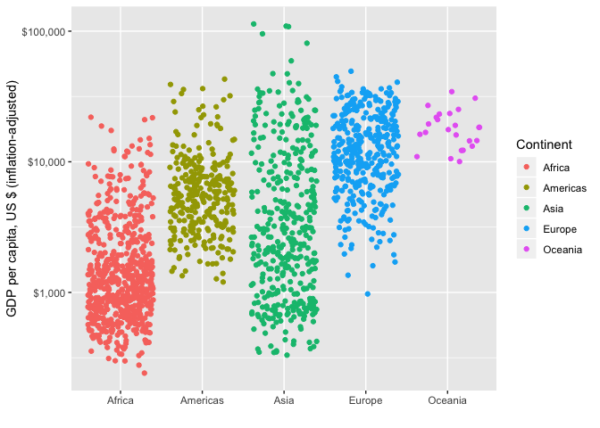
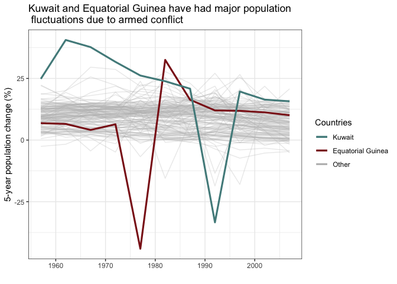

## Introduction

The gapminder dataset from the `gapminder` package is used for all analysis throughout this report.  Assignment 3 lists 6 different tasks and asks that we choose 3 out of the 6 tasks.  In this report, I have chosen

  * __Task Option 2__ - Get the maximum and minimum of GDP per capita for all continents
  * __Task Option 3__ - Look at the spread of GDP per capita within the continents
  * __Task Option 6__ - Find countries with interesting stories

***

## Task Option 2

### Max and Min GDP

Task Option 2 requests the maximum and minimum GDP per capita for all continents.  For this task, we produce

  1. a tibble called `mm.gpd` containing data for the maximum and minimum GDP per capita calculated by using the `group_by()` and `summarize()` functions from the `dplyr` package that is loaded via the `tidyverse` package and the respective corresponding countries and years,
  2. Table 1, displaying the country-level maximum and minimum GDP per capita from the `mm.gpd` tibble using the `kable()` function from the `knitr` package,
  3. Figure 1, a boxplot of the country-level GDP per capita data by continent using the `geom_boxplot()` function from `ggplot2` and coloring the points of the maximum country-level GDP per capita green and the minimum as red using the `geom_point()` function together with specifying colours in `aes()`,
  4. Table 2, displaying the minimum and maximum continent-level GDP per capita per year calculated as a population-weighted average of the country-level GDP per capita's in each continent.


```r
## Create tibble of maximum and minimum country-level GDP per capita by continent
mm.gdp <- gapminder %>%
  group_by(continent) %>%
  summarize(minGDP = min(gdpPercap), #Minimum GDP
            mincountry = country[gdpPercap == minGDP], #Corresponding Country
            minyear = year[gdpPercap == minGDP], #Corresponding Year
            maxGDP = max(gdpPercap), #Maximum GDP
            maxcountry = country[gdpPercap == maxGDP], #Corresponding Country
            maxyear = year[gdpPercap == maxGDP]) %>% #Corresponding Year
  mutate_at(vars(minGDP, maxGDP), ~round(., 2)) #round min/max GDP to 2 decimal places

## Table of minimum and maximum GDP
# datatable(mm.gdp, colnames=c('Continent', 'Minimum GDP', 'Min GDP Country', 'Min GDP Year', 
#                              'Maximum GDP', 'Max GDP Country', 'Max GDP Year'), 
#           caption='Table 1: Minimum and Maximum Country Level GDP per Capita by Continent and the corresponding countries and years')

kable(mm.gdp, col.names=c('Continent', 'Minimum<br>GDP', 'Minimum<br>GDP<br>Country', 'Minimum<br>GDP<br>Year', 
                             'Maximum<br>GDP', 'Maximum<br>GDP<br>Country', 'Maximum<br>GDP<br>Year'), 
      caption='Table 1: Minimum and Maximum Country Level GDP per Capita by Continent and the corresponding countries and years',
      align=rep('c', ncol(mm.gdp)))
```


Table: Table 1: Minimum and Maximum Country Level GDP per Capita by Continent and the corresponding countries and years

 Continent    Minimum<br>GDP    Minimum<br>GDP<br>Country    Minimum<br>GDP<br>Year    Maximum<br>GDP    Maximum<br>GDP<br>Country    Maximum<br>GDP<br>Year 
-----------  ----------------  ---------------------------  ------------------------  ----------------  ---------------------------  ------------------------
  Africa          241.17            Congo, Dem. Rep.                  2002                21951.21                 Libya                       1977          
 Americas        1201.64                  Haiti                       2007                42951.65             United States                   2007          
   Asia           331.00                 Myanmar                      1952               113523.13                Kuwait                       1957          
  Europe          973.53         Bosnia and Herzegovina               1952                49357.19                Norway                       2007          
  Oceania        10039.60               Australia                     1952                34435.37               Australia                     2007          

Boxplots of the country-level GDP per capita's by continent are given in Figure 1.  This plot is created using the `geom_boxplot()` function to create the boxplot layer along with `geom_point()` to highlight the maximum and minimums.  These functions are layers of the `ggplot` function from the `ggplot2` package.  The benefit of this plot is that the minimums are not always perceived as outliers in the boxplots.  Thus, displaying them is necessary if we want to focus on the maximum and minimums.


```r
clrs <- c("Maximum"="#62c76b", "Minimum"="#f04546")
gapminder %>% 
  ggplot(aes(x=continent, y=gdpPercap)) +
  geom_boxplot() +
  geom_point(data=mm.gdp, aes(x=continent, y=minGDP, colour="Minimum")) + 
  geom_point(data=mm.gdp, aes(x=continent, y=maxGDP, colour="Maximum")) +
  ggtitle(label='Boxplot of Country GDP per Capita by Continent') +
  xlab('Continent') + 
  scale_y_continuous('Country GDP per Capita', labels=scales::dollar_format()) +
  scale_colour_manual(name="Min/Max GDP",values=clrs) +
  theme_bw()
```


We also calculate continent-level GDP per capita using a population-weighted mean of the country level GDP per capita's for each continent.  This is done for each year in the tibble.  Table 2 displays the minimum and maximum continent-level GDP per capita's and corresponding years.


```r
mm.gdp2 <- gapminder %>% 
  group_by(continent, year) %>% 
  summarize(contGDP = min(weighted.mean(gdpPercap, w=pop))) %>% 
  summarize(minGDP = contGDP[which.min(contGDP)],
            minyear = year[which.min(contGDP)],
            maxGDP = contGDP[which.max(contGDP)],
            maxyear = year[which.max(contGDP)]) %>% 
  mutate_at(vars(minGDP, maxGDP), ~round(., 2))
  

kable(mm.gdp2, col.names=c('Continent', 'Minimum<br>GDP', 'Minimum<br>GDP<br>Year', 
                             'Maximum<br>GDP', 'Maximum<br>GDP<br>Year'), 
      caption='Table 1: Minimum and Maximum Continent Level GDP per Capita and the corresponding year',
      align=rep('c', ncol(mm.gdp)))
```


Table: Table 1: Minimum and Maximum Continent Level GDP per Capita and the corresponding year

 Continent    Minimum<br>GDP    Minimum<br>GDP<br>Year    Maximum<br>GDP    Maximum<br>GDP<br>Year 
-----------  ----------------  ------------------------  ----------------  ------------------------
  Africa         1311.22                 1952                2560.93                 2007          
 Americas        8528.04                 1952                21602.75                2007          
   Asia           806.36                 1952                5432.37                 2007          
  Europe         6096.66                 1952                25244.05                2007          
  Oceania        10136.10                1952                32884.56                2007          

---

## Task Option 3

### Spread of GDP per Capita within Continents


```r
o3 <- gapminder %>%
        group_by(continent) %>%
        summarize(summ=list(c(summary(gdpPercap) %>% round(digits=1)))) %>%
        unnest_wider(summ)
```


```r
o3g <- gapminder %>%
  group_by(continent) %>%
  ggplot(aes(x=continent,y=gdpPercap, colour=continent)) +
  geom_jitter() +
  scale_y_log10(labels=scales::dollar_format()) +
  labs(x="",
       y="GDP per capita, US $ (inflation-adjusted)",
       colour="Continent")
```

The table here shows the statistical summary describing GDP per capita over the 1952 to 2007 period. The graph also illustrates the full range of data plots by using a jittered layout to show every data point in the dataset. The log scale on the graph makes it easier to see detail at the lower end of the y-axis.


continent       Min.   1st Qu.    Median      Mean   3rd Qu.       Max.
----------  --------  --------  --------  --------  --------  ---------
Africa         241.2     761.2    1192.1    2193.8    2377.4    21951.2
Americas      1201.6    3427.8    5465.5    7136.1    7830.2    42951.7
Asia           331.0    1057.0    2646.8    7902.2    8549.3   113523.1
Europe         973.5    7213.1   12081.7   14469.5   20461.4    49357.2
Oceania      10039.6   14141.9   17983.3   18621.6   22214.1    34435.4

<!-- -->

---

## Task Option 6

### Countries with interesting stories.


```r
#main dataframe for all countries, this is what to graph by
df1 <- gapminder %>%
            group_by(country) %>%
            arrange(year) %>%
            mutate(popChg = tsibble::difference(pop),
                   popChg.pc = tsibble::difference(pop)/pop*100 %>% round(digits=1)) %>%
            drop_na() 
#make a summary dataframe of selected countries and mean of all others
df2 <- df1 %>%
      mutate(Group = ifelse(country=="Kuwait","KW", 
                              ifelse(country=="Equatorial Guinea", "EG", "All"))) %>%
      group_by(Group) %>%
      summarize(chg_1957=mean(popChg.pc[year==1957]) %>% round(1),
                chg_1962=mean(popChg.pc[year==1962]) %>% round(1),
                chg_1967=mean(popChg.pc[year==1967]) %>% round(1),
                chg_1972=mean(popChg.pc[year==1972]) %>% round(1),
                chg_1977=mean(popChg.pc[year==1977]) %>% round(1),
                chg_1982=mean(popChg.pc[year==1982]) %>% round(1),
                chg_1987=mean(popChg.pc[year==1987]) %>% round(1),
                chg_1992=mean(popChg.pc[year==1992]) %>% round(1),
                chg_1997=mean(popChg.pc[year==1997]) %>% round(1),
                chg_2002=mean(popChg.pc[year==2002]) %>% round(1), #its too wide for side-by-side
                chg_2007=mean(popChg.pc[year==2007]) %>% round(1)) #so must transpose below
    
#transposing the data... there must be an easier way
o6 <- df2 %>%
        t() %>% #transpose
        cbind(meanPopChg_Year=names(df2)) %>% #add a names column containing the years
        as_tibble(.name_repair="universal") %>% #make tibble, pre-slice because slice only works on tibble
        slice(-1) %>% #take out the first row, which does not have data
        rename(Other=...1, Eq_Guinea=...2, Kuwait=...3) %>% #rename the other columns
        select(meanPopChg_Year, everything()) %>% #move the ID column to the left
        select(-Other, Other) %>% #move Other to end, match legend order
        mutate_at(.vars=1, .funs=funs(substr(.,nchar(.)-3,nchar(.)))) %>% #keep just the year
        mutate_at(1:4, as.numeric) #change the column classes back to numeric
```


```r
#filtered dataframes for countries of interest
df.eg <- df1 %>% filter(country=="Equatorial Guinea")
df.kw <- df1 %>% filter(country=="Kuwait")

#plot it all together
o6g <-  df1 %>%
          ggplot(aes(y=popChg.pc,x=year,group=country)) +
            geom_line(aes(colour="grey"), alpha=0.3) +
            geom_line(data=df.eg, 
                      aes(y=popChg.pc,x=year,group=country,colour="firebrick4"),  
                      alpha=1, size=1.1) +
            geom_line(data=df.kw, 
                      aes(y=popChg.pc,x=year,group=country, colour="darkslategray4"), 
                      alpha=1, size=1.1) +
            scale_colour_manual(name="Countries", #for colours to be used in legend they need to be called in aes() within geom() functions
                                values=c("darkslategray4","firebrick4","grey"), #order apprently needs to be in reverse of when called
                                labels=c("Kuwait","Equatorial Guinea","Other")) + 
            theme_bw() +
            labs(title="Kuwait and Equatorial Guinea have had major population \n fluctuations due to armed conflict",
                 x="",
                 y="5-year population change (%)")
```

I looked for patterns in population change by country over the course of the dataset. Equatorial Guinea and Kuwait stood out because they both have periods that rank among the highest and lowest 5-year population changes among all countries. This is due to armed conflict, with Equatorial Guinea having a period of political violence and war in the 1970's and Kuwait being in conflict with Iraq in the late 1980's and early 1990's. The table and graph both show percentage change over 5-year periods.


 meanPopChg_Year   Eq_Guinea   Kuwait   Other
----------------  ----------  -------  ------
            1957         6.9     24.8     9.5
            1962         6.5     40.6     9.9
            1967         4.1     37.7    10.1
            1972         6.4     31.7     9.8
            1977       -44.1     26.2     9.8
            1982        32.5     23.8     9.5
            1987        16.3     20.8     9.3
            1992        12.0    -33.4     9.1
            1997        11.8     19.7     8.2
            2002        11.2     16.4     7.6
            2007        10.1     15.7     6.9

<!-- -->

