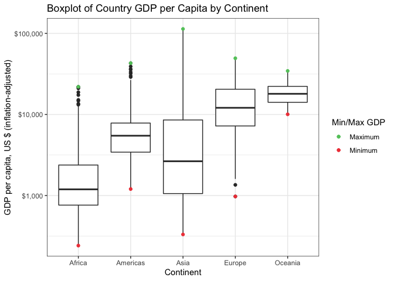
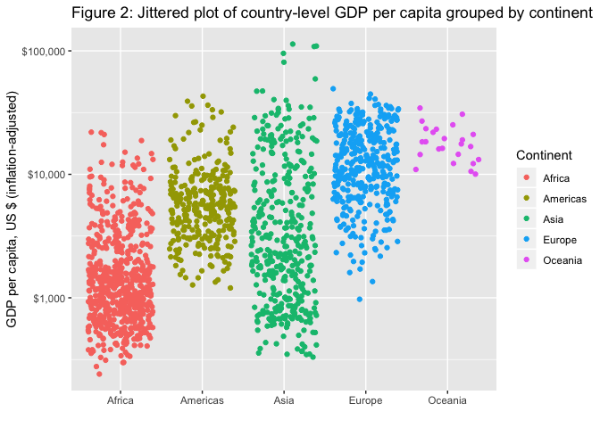
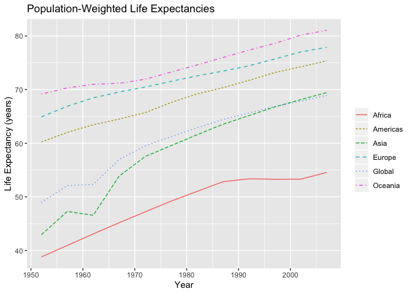

## Introduction

The gapminder dataset from the `gapminder` package is used for all analysis throughout this report.  Assignment 3 lists 6 different tasks and asks that we choose 3 out of the 6 tasks.  In this report, I have chosen

  * __Task Option 2__ - Get the maximum and minimum of GDP per capita for all continents
  * __Task Option 3__ - Look at the spread of GDP per capita within the continents
  * __Task Option 6__ - Find countries with interesting stories

***

## Task Option 2

### Max and Min GDP

Task Option 2 requests the maximum and minimum GDP per capita for all continents.  For this task, we produce

  1. a tibble called `mm.gpd` containing data for the maximum and minimum GDP per capita calculated by using the `group_by()` and `summarize()` functions from the `dplyr` package that is loaded via the `tidyverse` package and the respective corresponding countries and years,
  2. Table 1, displaying the country-level maximum and minimum GDP per capita from the `mm.gpd` tibble using the `kable()` function from the `knitr` package,
  3. Figure 1, a boxplot of the country-level GDP per capita data by continent using the `geom_boxplot()` function from `ggplot2` and coloring the points of the maximum country-level GDP per capita green and the minimum as red using the `geom_point()` function together with specifying colours in `aes()`,
  4. Table 2, displaying the minimum and maximum continent-level GDP per capita per year calculated as a population-weighted average of the country-level GDP per capita's in each continent.


```r
## Create tibble of maximum and minimum country-level GDP per capita by continent
mm.gdp <- gapminder %>%
  group_by(continent) %>%
  summarize(minGDP = min(gdpPercap), #Minimum GDP
            mincountry = country[gdpPercap == minGDP], #Corresponding Country
            minyear = year[gdpPercap == minGDP], #Corresponding Year
            maxGDP = max(gdpPercap), #Maximum GDP
            maxcountry = country[gdpPercap == maxGDP], #Corresponding Country
            maxyear = year[gdpPercap == maxGDP]) %>% #Corresponding Year
  mutate_at(vars(minGDP, maxGDP), ~round(., 2)) #round min/max GDP to 2 decimal places

## Table of Minimum and Maximum GDP
kable(mm.gdp, col.names=c('Continent', 'Minimum<br>GDP', 'Minimum<br>GDP<br>Country', 'Minimum<br>GDP<br>Year', 
                             'Maximum<br>GDP', 'Maximum<br>GDP<br>Country', 'Maximum<br>GDP<br>Year'), 
      caption=tab.cap[1],
      align=rep('c', ncol(mm.gdp)))
```


Table: Table 1: Minimum and Maximum Country Level GDP per Capita by Continent and the corresponding countries and years

 Continent    Minimum<br>GDP    Minimum<br>GDP<br>Country    Minimum<br>GDP<br>Year    Maximum<br>GDP    Maximum<br>GDP<br>Country    Maximum<br>GDP<br>Year 
-----------  ----------------  ---------------------------  ------------------------  ----------------  ---------------------------  ------------------------
  Africa          241.17            Congo, Dem. Rep.                  2002                21951.21                 Libya                       1977          
 Americas        1201.64                  Haiti                       2007                42951.65             United States                   2007          
   Asia           331.00                 Myanmar                      1952               113523.13                Kuwait                       1957          
  Europe          973.53         Bosnia and Herzegovina               1952                49357.19                Norway                       2007          
  Oceania        10039.60               Australia                     1952                34435.37               Australia                     2007          

Boxplots of the country-level GDP per capita's by continent are given in Figure 1.  This plot is created using the `geom_boxplot()` function to create the boxplot layer along with `geom_point()` to highlight the maximum and minimums.  These functions are layers of the `ggplot` function from the `ggplot2` package.  The benefit of this plot is that the minimums and maximums are not always perceived as outliers in the boxplots due to the log scale used on the y-axis.  Thus, expliciting highlighting the points reaffirms their position on the boxplot.  I used code from the following [stackoverflow thread](https://stackoverflow.com/questions/17148679/construct-a-manual-legend-for-a-complicated-plot) to create the custom legend.


```r
clrs <- c("Maximum"="#62c76b", "Minimum"="#f04546")
gapminder %>% 
  ggplot(aes(x=continent, y=gdpPercap)) +
  geom_boxplot() +
  geom_point(data=mm.gdp, aes(x=continent, y=minGDP, colour="Minimum")) + 
  geom_point(data=mm.gdp, aes(x=continent, y=maxGDP, colour="Maximum")) +
  ggtitle(label='Boxplot of Country GDP per Capita by Continent') +
  xlab('Continent') + 
  scale_y_log10('GDP per capita, US $ (inflation-adjusted)', labels=scales::dollar_format()) +
  scale_colour_manual(name="Min/Max GDP",values=clrs) +
  theme_bw()
```



We also calculate continent-level GDP per capita using a population-weighted mean of the country level GDP per capita's for each continent.  This is done for each year in the tibble.  Table 2 displays the minimum and maximum continent-level GDP per capita's and corresponding years.


```r
mm.gdp2 <- gapminder %>% 
  group_by(continent, year) %>% 
  summarize(contGDP = min(weighted.mean(gdpPercap, w=pop))) %>% 
  summarize(minGDP = contGDP[which.min(contGDP)],
            minyear = year[which.min(contGDP)],
            maxGDP = contGDP[which.max(contGDP)],
            maxyear = year[which.max(contGDP)]) %>% 
  mutate_at(vars(minGDP, maxGDP), ~round(., 2))
  

kable(mm.gdp2, col.names=c('Continent', 'Minimum<br>GDP', 'Minimum<br>GDP<br>Year', 
                             'Maximum<br>GDP', 'Maximum<br>GDP<br>Year'), 
      caption=tab.cap[2],
      align=rep('c', ncol(mm.gdp)))
```


Table: Table 2: Minimum and Maximum Continent Level GDP per Capita and the corresponding year

 Continent    Minimum<br>GDP    Minimum<br>GDP<br>Year    Maximum<br>GDP    Maximum<br>GDP<br>Year 
-----------  ----------------  ------------------------  ----------------  ------------------------
  Africa         1311.22                 1952                2560.93                 2007          
 Americas        8528.04                 1952                21602.75                2007          
   Asia           806.36                 1952                5432.37                 2007          
  Europe         6096.66                 1952                25244.05                2007          
  Oceania        10136.10                1952                32884.56                2007          

---

## Task Option 3

### Spread of GDP per Capita

Task Option 3 asks us to look at the spread of the country-level GDP per capita data within the continents.  To do this, we create

  1. a tibble called `gdp.spread` which is used to create a table of summary statistics on country-level GDP per capita and a jittered scatterplot,
  2. Table 3, which shows summary statistics for the distribution of GDP per capita for each continent,
  3. Figure 2, which plots country GDP per capita against continent as a jittered scatterplot.


```r
gdp.spread <- gapminder %>%
  group_by(continent) %>%
  summarize(summ=list(c(summary(gdpPercap) %>% round(digits=1)))) %>%
  unnest_wider(summ)
```

The code for producing side-by-side tables and figures for html output was taken from [this thread](https://gist.github.com/oganm/abef941dd42934b5ec4a35adc6b86850).

<table>
    <tr>
    <th>
    

Table: Table 3: Summary statistics for the Distribution of Country GDP per Capita by Continent

Continent   Min   First<br>Quartile  Median  Mean   Third<br>Quartile   Max  
---------  -----  -----------------  ------  -----  -----------------  ------
 Africa     241          761          1192   2194         2377         21951 
Americas   1202         3428          5466   7136         7830         42952 
  Asia      331         1057          2647   7902         8549         113523
 Europe     974         7213         12082   14470        20461        49357 
 Oceania   10040        14142        17983   18622        22214        34435 

</th>

<!--

```r
gapminder %>%
  group_by(continent) %>%
  ggplot(aes(x=continent, y=gdpPercap, colour=continent)) +
  geom_jitter() +
  scale_y_log10(labels=scales::dollar_format()) +
  labs(title=fig.cap[2], 
      x="",
      y='GDP per capita, US $ (inflation-adjusted)',
      colour='Continent')
```


-->

<th>

</th>
</tr>
</table>

---

## Task Option 4

### Population-weighted Life Expectancy

For this task, we

  1. create a tibble called `life.exp` which includes population-weighted life expectancy across all countries for each year, which we refer to as the global life expectancy, and population-weighted life expectancies for the countries within each continent for each year,
  2. create Table 4 to show the global life expectancies and continent life expectancies, weighted by country population, for each year,
  3. create Figure 3, a time series plot of the global life expectancies and the continent life expectancies weighted by country population.


```r
life.exp <- gapminder %>% 
  group_by(year) %>% 
  mutate(global = weighted.mean(lifeExp, w=pop)) %>% 
  ungroup() %>% 
  group_by(continent, year) %>% 
  mutate(cont.le = weighted.mean(lifeExp, w=pop)) %>% 
  ungroup() %>%
  group_by(year) %>%
  summarize(Global=unique(global),
            Africa=unique(cont.le[continent == 'Africa']),
            Americas=unique(cont.le[continent == 'Americas']),
            Asia=unique(cont.le[continent == 'Asia']),
            Europe=unique(cont.le[continent == 'Europe']),
            Oceania=unique(cont.le[continent == 'Oceania'])) %>%
  mutate_all(~round(., 2))

datatable(life.exp, colnames=c('Year', names(life.exp[-1])), caption=tab.cap[4])
```

<!--html_preserve--><div id="htmlwidget-cd91b5264f5122eea443" style="width:100%;height:auto;" class="datatables html-widget"></div>
<script type="application/json" data-for="htmlwidget-cd91b5264f5122eea443">{"x":{"filter":"none","caption":"<caption>Table 4: Life expectancies (in years) using population-weighted means across all countries globally and within continents<\/caption>","data":[["1","2","3","4","5","6","7","8","9","10","11","12"],[1952,1957,1962,1967,1972,1977,1982,1987,1992,1997,2002,2007],[48.94,52.12,52.32,56.98,59.51,61.24,62.88,64.42,65.65,66.85,67.84,68.92],[38.8,40.94,43.1,45.18,47.21,49.21,51.02,52.82,53.37,53.28,53.3,54.56],[60.24,62.02,63.44,64.51,65.7,67.61,69.19,70.36,71.72,73.19,74.25,75.36],[42.94,47.29,46.57,53.88,57.52,59.56,61.57,63.54,65.15,66.77,68.14,69.44],[64.91,66.89,68.46,69.55,70.47,71.54,72.56,73.45,74.44,75.71,77.02,77.89],[69.17,70.32,70.99,71.18,71.92,73.26,74.58,75.98,77.36,78.62,80.16,81.06]],"container":"<table class=\"display\">\n  <thead>\n    <tr>\n      <th> <\/th>\n      <th>Year<\/th>\n      <th>Global<\/th>\n      <th>Africa<\/th>\n      <th>Americas<\/th>\n      <th>Asia<\/th>\n      <th>Europe<\/th>\n      <th>Oceania<\/th>\n    <\/tr>\n  <\/thead>\n<\/table>","options":{"columnDefs":[{"className":"dt-right","targets":[1,2,3,4,5,6,7]},{"orderable":false,"targets":0}],"order":[],"autoWidth":false,"orderClasses":false}},"evals":[],"jsHooks":[]}</script><!--/html_preserve-->

Since the Table 4 does not make it easy to visualize trends or make comparisons, the following plot shows a time series of the population-weighted life expectancies for all countries and population-weighted life expectancies for countries within each continent.  There is an obvious upward trend in life expectancies over time.


```r
Global <- as_tibble(data.frame('continent'=rep('Global', nrow(life.exp)), 'year'=life.exp$year, 'cont.le'=life.exp$Global, stringsAsFactors=FALSE))

gapminder %>% 
  group_by(year) %>% 
  mutate(global = weighted.mean(lifeExp, w=pop)) %>% 
  ungroup() %>% 
  group_by(continent, year) %>% 
  summarize(cont.le = weighted.mean(lifeExp, w=pop)) %>%
  ungroup() %>% 
  mutate(continent=as.character(continent)) %>% 
  rbind(., Global) %>% 
  mutate_at(vars(continent), ~as.factor(.)) %>% 
  ggplot(aes(x=year, y=cont.le, colour=continent, linetype=continent)) +
  geom_line() +
  labs(title="Population-Weighted Life Expectancies", color="", linetype="",
       x='Year', y='Life Expectancy (years)')
```


