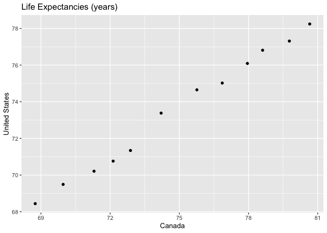

## Introduction

For this analysis, we load the `gapminder`, `tidyverse`, `knitrr` and `DT` packages.  The code to load these packages is not displayed in the report.  Data wrangling is performed on the gapminder dataset.  In this report, I have chosen the following:

  * [__Univariate Option 1__](#exercise-1---univariate-option-1):
    - Make a new tibble with one row per year, and columns for the life expectancy for two countries
    - Take advantage of this new data shape to scatterplot life expectancy for one country against that of another
    - Re-lengthen the data
  * [__Multivariate Option 1__](#exercise-2---multivariate-option-1):
    - Make a tibble with one row per year and columns for both life expectancies and GDP per capita for two countries
    - Re-lengthen the data
  * [__Exercise 3__](#exercise-3---table-joins):
    - For each guest in the guestlist (`guest` tibble), add a column for email address which can be found in the `email` tibble
    - Who do we have emails for, yet are not on the guestlist
    - Make a guest list that includes everyone we have emails for (in addition to those on the original guestlist)


## Exercise 1 - Univariate Option 1

### Make a Tibble

Observations in the `gapminder::gapminder` dataset can be defined as country/year.  Thus, the dataset can be considered tidy since each row corresponds to one country/year observation.  In this section, we make a tibble with one row per year and columns for life expectancy for Canada and United States.  The data is presented in Table 1.


```r
can.us <- gapminder %>% 
  filter(country == "Canada" | country == "United States") %>% #filter by country
  select(year, country, lifeExp) %>% #select columns of interest
  pivot_wider(id_cols = year, #observations
              names_from = country, #new column names
              values_from = lifeExp) #new column values

datatable(can.us, caption=tab.cap[1])
```

<!--html_preserve--><div id="htmlwidget-9f826f7ae8da56c1e79b" style="width:100%;height:auto;" class="datatables html-widget"></div>
<script type="application/json" data-for="htmlwidget-9f826f7ae8da56c1e79b">{"x":{"filter":"none","caption":"<caption>Table 1: Life expectancies (years) for Canada and the United States<\/caption>","data":[["1","2","3","4","5","6","7","8","9","10","11","12"],[1952,1957,1962,1967,1972,1977,1982,1987,1992,1997,2002,2007],[68.75,69.96,71.3,72.13,72.88,74.21,75.76,76.86,77.95,78.61,79.77,80.653],[68.44,69.49,70.21,70.76,71.34,73.38,74.65,75.02,76.09,76.81,77.31,78.242]],"container":"<table class=\"display\">\n  <thead>\n    <tr>\n      <th> <\/th>\n      <th>year<\/th>\n      <th>Canada<\/th>\n      <th>United States<\/th>\n    <\/tr>\n  <\/thead>\n<\/table>","options":{"columnDefs":[{"className":"dt-right","targets":[1,2,3]},{"orderable":false,"targets":0}],"order":[],"autoWidth":false,"orderClasses":false}},"evals":[],"jsHooks":[]}</script><!--/html_preserve-->

### Scatterplot

In this section, we use the new tibble `can.us` to produce a scatterplot of the life expectancy of Canada versus the life expectancy of the United States.  Note that since the column name "United States" has a space, the code uses backticks, \`United States\`, so that the aesthetics are properly mapped.


```r
can.us %>% 
  ggplot(aes(Canada, `United States`)) +
  geom_point(shape=1, aes(size=year)) +
  ggtitle(label='Scatterplot of Life Expectancies (years) for Two Countries')
```



### Re-lengthen 

The `can.us` tibble is re-lengthened so that observations are year/country combinations and presented as Table 2.


```r
can.us %>% 
  pivot_longer(cols = c("Canada", "United States"),
               names_to = "country",
               values_to = "lifeExp") %>% 
  arrange(country) %>% 
  datatable(caption=tab.cap[2])
```

<!--html_preserve--><div id="htmlwidget-c294c35698ef3a1699b2" style="width:100%;height:auto;" class="datatables html-widget"></div>
<script type="application/json" data-for="htmlwidget-c294c35698ef3a1699b2">{"x":{"filter":"none","caption":"<caption>Table 2: Re-lengthened dataset of life expectancies for Canada and the United States<\/caption>","data":[["1","2","3","4","5","6","7","8","9","10","11","12","13","14","15","16","17","18","19","20","21","22","23","24"],[1952,1957,1962,1967,1972,1977,1982,1987,1992,1997,2002,2007,1952,1957,1962,1967,1972,1977,1982,1987,1992,1997,2002,2007],["Canada","Canada","Canada","Canada","Canada","Canada","Canada","Canada","Canada","Canada","Canada","Canada","United States","United States","United States","United States","United States","United States","United States","United States","United States","United States","United States","United States"],[68.75,69.96,71.3,72.13,72.88,74.21,75.76,76.86,77.95,78.61,79.77,80.653,68.44,69.49,70.21,70.76,71.34,73.38,74.65,75.02,76.09,76.81,77.31,78.242]],"container":"<table class=\"display\">\n  <thead>\n    <tr>\n      <th> <\/th>\n      <th>year<\/th>\n      <th>country<\/th>\n      <th>lifeExp<\/th>\n    <\/tr>\n  <\/thead>\n<\/table>","options":{"columnDefs":[{"className":"dt-right","targets":[1,3]},{"orderable":false,"targets":0}],"order":[],"autoWidth":false,"orderClasses":false}},"evals":[],"jsHooks":[]}</script><!--/html_preserve-->

## Exercise 2 - Multivariate Option 1

### Make a Tibble

In this section, we make a tibble with one row per year and columns for both life expectancy and GDP per capita for two countries, China and India and presented in Table 3.  Separating the data and country by underscore in the column names leads to easier re-lengthening in the next section.


```r
ch.in <- gapminder %>% 
  filter(country == "China" | country == "India") %>% #filter by country
  select(country, year, lifeExp, gdpPercap) %>% #columns of interest
  pivot_wider(id_cols = year,
              names_from = country,
              values_from = c(lifeExp, gdpPercap)) %>% 
  mutate_at(vars(-year), ~round(., 2)) #round numeric data

datatable(ch.in, caption=tab.cap[3])
```

<!--html_preserve--><div id="htmlwidget-e62e14f5dab061561954" style="width:100%;height:auto;" class="datatables html-widget"></div>
<script type="application/json" data-for="htmlwidget-e62e14f5dab061561954">{"x":{"filter":"none","caption":"<caption>Table 3: Life expectancies (years) and GDP per capitas ($US-inflation adjusted) for China and India<\/caption>","data":[["1","2","3","4","5","6","7","8","9","10","11","12"],[1952,1957,1962,1967,1972,1977,1982,1987,1992,1997,2002,2007],[44,50.55,44.5,58.38,63.12,63.97,65.53,67.27,68.69,70.43,72.03,72.96],[37.37,40.25,43.6,47.19,50.65,54.21,56.6,58.55,60.22,61.77,62.88,64.7],[400.45,575.99,487.67,612.71,676.9,741.24,962.42,1378.9,1655.78,2289.23,3119.28,4959.11],[546.57,590.06,658.35,700.77,724.03,813.34,855.72,976.51,1164.41,1458.82,1746.77,2452.21]],"container":"<table class=\"display\">\n  <thead>\n    <tr>\n      <th> <\/th>\n      <th>year<\/th>\n      <th>lifeExp_China<\/th>\n      <th>lifeExp_India<\/th>\n      <th>gdpPercap_China<\/th>\n      <th>gdpPercap_India<\/th>\n    <\/tr>\n  <\/thead>\n<\/table>","options":{"columnDefs":[{"className":"dt-right","targets":[1,2,3,4,5]},{"orderable":false,"targets":0}],"order":[],"autoWidth":false,"orderClasses":false}},"evals":[],"jsHooks":[]}</script><!--/html_preserve-->

### Re-lengthen

In this section, we re-lengthen the data so that an observation is defined as a year/country intersection.  The data is presented in Table 4.  Since we have 2 countries and 12 years, Table 4 has 24 rows instead of the 12 rows of Table 3.


```r
ch.in %>% 
  pivot_longer(cols = -year,
               names_to = c(".value", "country"),
               names_sep = "_") %>% 
  arrange(country) %>% 
  datatable(caption=tab.cap[4])
```

<!--html_preserve--><div id="htmlwidget-705c6f511ebc3a7fb56d" style="width:100%;height:auto;" class="datatables html-widget"></div>
<script type="application/json" data-for="htmlwidget-705c6f511ebc3a7fb56d">{"x":{"filter":"none","caption":"<caption>Table 4: Re-lengthed dataset from Table 3<\/caption>","data":[["1","2","3","4","5","6","7","8","9","10","11","12","13","14","15","16","17","18","19","20","21","22","23","24"],[1952,1957,1962,1967,1972,1977,1982,1987,1992,1997,2002,2007,1952,1957,1962,1967,1972,1977,1982,1987,1992,1997,2002,2007],["China","China","China","China","China","China","China","China","China","China","China","China","India","India","India","India","India","India","India","India","India","India","India","India"],[44,50.55,44.5,58.38,63.12,63.97,65.53,67.27,68.69,70.43,72.03,72.96,37.37,40.25,43.6,47.19,50.65,54.21,56.6,58.55,60.22,61.77,62.88,64.7],[400.45,575.99,487.67,612.71,676.9,741.24,962.42,1378.9,1655.78,2289.23,3119.28,4959.11,546.57,590.06,658.35,700.77,724.03,813.34,855.72,976.51,1164.41,1458.82,1746.77,2452.21]],"container":"<table class=\"display\">\n  <thead>\n    <tr>\n      <th> <\/th>\n      <th>year<\/th>\n      <th>country<\/th>\n      <th>lifeExp<\/th>\n      <th>gdpPercap<\/th>\n    <\/tr>\n  <\/thead>\n<\/table>","options":{"columnDefs":[{"className":"dt-right","targets":[1,3,4]},{"orderable":false,"targets":0}],"order":[],"autoWidth":false,"orderClasses":false}},"evals":[],"jsHooks":[]}</script><!--/html_preserve-->

## Exercise 3 - Table Joins

We begin by importing made-up wedding guestlist and e-mail addresses using the `read_csv()` function from the `readr` package which is automatically loaded with the `tidyverse` package.


```r
guest <- read_csv("https://raw.githubusercontent.com/STAT545-UBC/Classroom/master/data/wedding/attend.csv")
email <- read_csv("https://raw.githubusercontent.com/STAT545-UBC/Classroom/master/data/wedding/emails.csv")
```

### 3.1 - Add E-mail Column

For each guest in the guestlist (tibble `guest`), we add a column for the e-mail address.  The `separate_rows()` function is easy to use here due to the formatting of the names in the "guest" column of the `email` tibble. Then, we can compare separated rows to the `guest` tibble using the `right_join()` function.  The results are presented in Table 5.


```r
#First separate rows in email tibble to get one guest per row
guest.email <- email %>% 
  separate_rows(guest, sep = ", ") %>% #create row per guest name
  right_join(guest, by=c("guest" = "name")) #adds emails to guest tibble

datatable(guest.email, caption=tab.cap[5])
```

<!--html_preserve--><div id="htmlwidget-171a5449acca2a73d4e4" style="width:100%;height:auto;" class="datatables html-widget"></div>
<script type="application/json" data-for="htmlwidget-171a5449acca2a73d4e4">{"x":{"filter":"none","caption":"<caption>Table 5: Guest list with e-mails where available<\/caption>","data":[["1","2","3","4","5","6","7","8","9","10","11","12","13","14","15","16","17","18","19","20","21","22","23","24","25","26","27","28","29","30"],["Sommer Medrano","Phillip Medrano","Blanka Medrano","Emaan Medrano","Blair Park","Nigel Webb","Sinead English","Ayra Marks","Atlanta Connolly","Denzel Connolly","Chanelle Shah","Jolene Welsh","Hayley Booker","Amayah Sanford","Erika Foley","Ciaron Acosta","Diana Stuart","Cosmo Dunkley","Cai Mcdaniel","Daisy-May Caldwell","Martin Caldwell","Violet Caldwell","Nazifa Caldwell","Eric Caldwell","Rosanna Bird","Kurtis Frost","Huma Stokes","Samuel Rutledge","Eddison Collier","Stewart Nicholls"],["sommm@gmail.com","sommm@gmail.com","sommm@gmail.com","sommm@gmail.com","bpark@gmail.com","bpark@gmail.com","singlish@hotmail.ca","marksa42@gmail.com",null,null,null,"jw1987@hotmail.com","jw1987@hotmail.com","erikaaaaaa@gmail.com","erikaaaaaa@gmail.com","shining_ciaron@gmail.com","doodledianastu@gmail.com",null,null,"caldwellfamily5212@gmail.com","caldwellfamily5212@gmail.com","caldwellfamily5212@gmail.com","caldwellfamily5212@gmail.com","caldwellfamily5212@gmail.com","rosy1987b@gmail.com","rosy1987b@gmail.com","humastokes@gmail.com","humastokes@gmail.com","eddison.collier@gmail.com","eddison.collier@gmail.com"],[1,1,1,1,2,2,3,4,5,5,5,6,6,7,7,8,9,10,11,12,12,12,12,12,13,13,14,14,15,15],["PENDING","vegetarian","chicken","PENDING","chicken",null,"PENDING","vegetarian","PENDING","fish","chicken",null,"vegetarian",null,"PENDING","PENDING","vegetarian","PENDING","fish","chicken","PENDING","PENDING","chicken","chicken","vegetarian","PENDING",null,"chicken","PENDING","chicken"],["PENDING","Menu C","Menu A","PENDING","Menu C",null,"PENDING","Menu B","PENDING","Menu B","Menu C",null,"Menu C","PENDING","PENDING","Menu A","Menu C","PENDING","Menu C","Menu B","PENDING","PENDING","PENDING","Menu B","Menu C","PENDING",null,"Menu C","PENDING","Menu B"],["PENDING","CONFIRMED","CONFIRMED","PENDING","CONFIRMED","CANCELLED","PENDING","PENDING","PENDING","CONFIRMED","CONFIRMED","CANCELLED","CONFIRMED","CANCELLED","PENDING","PENDING","CONFIRMED","PENDING","CONFIRMED","CONFIRMED","PENDING","PENDING","PENDING","CONFIRMED","CONFIRMED","PENDING","CANCELLED","CONFIRMED","PENDING","CONFIRMED"],["PENDING","CONFIRMED","CONFIRMED","PENDING","CONFIRMED","CANCELLED","PENDING","PENDING","PENDING","CONFIRMED","CONFIRMED","CANCELLED","CONFIRMED","PENDING","PENDING","PENDING","CONFIRMED","PENDING","CONFIRMED","CONFIRMED","PENDING","PENDING","PENDING","CONFIRMED","CONFIRMED","PENDING","CANCELLED","CONFIRMED","PENDING","CONFIRMED"],["PENDING","CONFIRMED","CONFIRMED","PENDING","CONFIRMED","CANCELLED","PENDING","PENDING","PENDING","CONFIRMED","CONFIRMED","CANCELLED","CONFIRMED","PENDING","PENDING","PENDING","CONFIRMED","PENDING","CONFIRMED","CONFIRMED","PENDING","PENDING","PENDING","CONFIRMED","CONFIRMED","PENDING","CANCELLED","CONFIRMED","PENDING","CONFIRMED"]],"container":"<table class=\"display\">\n  <thead>\n    <tr>\n      <th> <\/th>\n      <th>guest<\/th>\n      <th>email<\/th>\n      <th>party<\/th>\n      <th>meal_wedding<\/th>\n      <th>meal_brunch<\/th>\n      <th>attendance_wedding<\/th>\n      <th>attendance_brunch<\/th>\n      <th>attendance_golf<\/th>\n    <\/tr>\n  <\/thead>\n<\/table>","options":{"columnDefs":[{"className":"dt-right","targets":3},{"orderable":false,"targets":0}],"order":[],"autoWidth":false,"orderClasses":false}},"evals":[],"jsHooks":[]}</script><!--/html_preserve-->

We see that there are 5 guests that do not have an e-mail address in the `email` tibble.  These guests are 

Table: Table 6: Guests from the guest list with no e-mail available

|guest            |
|:----------------|
|Atlanta Connolly |
|Denzel Connolly  |
|Chanelle Shah    |
|Cosmo Dunkley    |
|Cai Mcdaniel     |


### 3.2 - E-mails not on Guestlist

In this section, we find e-mails in the `email` tibble for persons not on the guestlist.  Using `anti_join()`, this list is created and presented in Table 7.


```r
email.only <- email %>%
  separate_rows(guest, sep=", ") %>% #create one row per person in email tibble
  anti_join(guest, by=c("guest" = "name")) #compare email$guest to guest$name

datatable(email.only, caption=tab.cap[7])
```

<!--html_preserve--><div id="htmlwidget-069343ad4df3cade9088" style="width:100%;height:auto;" class="datatables html-widget"></div>
<script type="application/json" data-for="htmlwidget-069343ad4df3cade9088">{"x":{"filter":"none","caption":"<caption>Table 7: Names of people with e-mails available that are not on the guest list<\/caption>","data":[["1","2","3"],["Turner Jones","Albert Marshall","Vivian Marshall"],["tjjones12@hotmail.ca","themarshallfamily1234@gmail.com","themarshallfamily1234@gmail.com"]],"container":"<table class=\"display\">\n  <thead>\n    <tr>\n      <th> <\/th>\n      <th>guest<\/th>\n      <th>email<\/th>\n    <\/tr>\n  <\/thead>\n<\/table>","options":{"order":[],"autoWidth":false,"orderClasses":false,"columnDefs":[{"orderable":false,"targets":0}]}},"evals":[],"jsHooks":[]}</script><!--/html_preserve-->


### 3.3 - Expand Guestlist
In this section, we combine the guest list with the e-mail list so that each name appears exactly once in a new tibble.


```r
guest.email %>%
  bind_rows(email.only) %>% 
datatable(caption=tab.cap[8])
```

<!--html_preserve--><div id="htmlwidget-d8a23c6cd121d3b1521c" style="width:100%;height:auto;" class="datatables html-widget"></div>
<script type="application/json" data-for="htmlwidget-d8a23c6cd121d3b1521c">{"x":{"filter":"none","caption":"<caption>Table 8: Combined tibble of all people either on the guest list or the e-mail list<\/caption>","data":[["1","2","3","4","5","6","7","8","9","10","11","12","13","14","15","16","17","18","19","20","21","22","23","24","25","26","27","28","29","30","31","32","33"],["Sommer Medrano","Phillip Medrano","Blanka Medrano","Emaan Medrano","Blair Park","Nigel Webb","Sinead English","Ayra Marks","Atlanta Connolly","Denzel Connolly","Chanelle Shah","Jolene Welsh","Hayley Booker","Amayah Sanford","Erika Foley","Ciaron Acosta","Diana Stuart","Cosmo Dunkley","Cai Mcdaniel","Daisy-May Caldwell","Martin Caldwell","Violet Caldwell","Nazifa Caldwell","Eric Caldwell","Rosanna Bird","Kurtis Frost","Huma Stokes","Samuel Rutledge","Eddison Collier","Stewart Nicholls","Turner Jones","Albert Marshall","Vivian Marshall"],["sommm@gmail.com","sommm@gmail.com","sommm@gmail.com","sommm@gmail.com","bpark@gmail.com","bpark@gmail.com","singlish@hotmail.ca","marksa42@gmail.com",null,null,null,"jw1987@hotmail.com","jw1987@hotmail.com","erikaaaaaa@gmail.com","erikaaaaaa@gmail.com","shining_ciaron@gmail.com","doodledianastu@gmail.com",null,null,"caldwellfamily5212@gmail.com","caldwellfamily5212@gmail.com","caldwellfamily5212@gmail.com","caldwellfamily5212@gmail.com","caldwellfamily5212@gmail.com","rosy1987b@gmail.com","rosy1987b@gmail.com","humastokes@gmail.com","humastokes@gmail.com","eddison.collier@gmail.com","eddison.collier@gmail.com","tjjones12@hotmail.ca","themarshallfamily1234@gmail.com","themarshallfamily1234@gmail.com"],[1,1,1,1,2,2,3,4,5,5,5,6,6,7,7,8,9,10,11,12,12,12,12,12,13,13,14,14,15,15,null,null,null],["PENDING","vegetarian","chicken","PENDING","chicken",null,"PENDING","vegetarian","PENDING","fish","chicken",null,"vegetarian",null,"PENDING","PENDING","vegetarian","PENDING","fish","chicken","PENDING","PENDING","chicken","chicken","vegetarian","PENDING",null,"chicken","PENDING","chicken",null,null,null],["PENDING","Menu C","Menu A","PENDING","Menu C",null,"PENDING","Menu B","PENDING","Menu B","Menu C",null,"Menu C","PENDING","PENDING","Menu A","Menu C","PENDING","Menu C","Menu B","PENDING","PENDING","PENDING","Menu B","Menu C","PENDING",null,"Menu C","PENDING","Menu B",null,null,null],["PENDING","CONFIRMED","CONFIRMED","PENDING","CONFIRMED","CANCELLED","PENDING","PENDING","PENDING","CONFIRMED","CONFIRMED","CANCELLED","CONFIRMED","CANCELLED","PENDING","PENDING","CONFIRMED","PENDING","CONFIRMED","CONFIRMED","PENDING","PENDING","PENDING","CONFIRMED","CONFIRMED","PENDING","CANCELLED","CONFIRMED","PENDING","CONFIRMED",null,null,null],["PENDING","CONFIRMED","CONFIRMED","PENDING","CONFIRMED","CANCELLED","PENDING","PENDING","PENDING","CONFIRMED","CONFIRMED","CANCELLED","CONFIRMED","PENDING","PENDING","PENDING","CONFIRMED","PENDING","CONFIRMED","CONFIRMED","PENDING","PENDING","PENDING","CONFIRMED","CONFIRMED","PENDING","CANCELLED","CONFIRMED","PENDING","CONFIRMED",null,null,null],["PENDING","CONFIRMED","CONFIRMED","PENDING","CONFIRMED","CANCELLED","PENDING","PENDING","PENDING","CONFIRMED","CONFIRMED","CANCELLED","CONFIRMED","PENDING","PENDING","PENDING","CONFIRMED","PENDING","CONFIRMED","CONFIRMED","PENDING","PENDING","PENDING","CONFIRMED","CONFIRMED","PENDING","CANCELLED","CONFIRMED","PENDING","CONFIRMED",null,null,null]],"container":"<table class=\"display\">\n  <thead>\n    <tr>\n      <th> <\/th>\n      <th>guest<\/th>\n      <th>email<\/th>\n      <th>party<\/th>\n      <th>meal_wedding<\/th>\n      <th>meal_brunch<\/th>\n      <th>attendance_wedding<\/th>\n      <th>attendance_brunch<\/th>\n      <th>attendance_golf<\/th>\n    <\/tr>\n  <\/thead>\n<\/table>","options":{"columnDefs":[{"className":"dt-right","targets":3},{"orderable":false,"targets":0}],"order":[],"autoWidth":false,"orderClasses":false}},"evals":[],"jsHooks":[]}</script><!--/html_preserve-->


