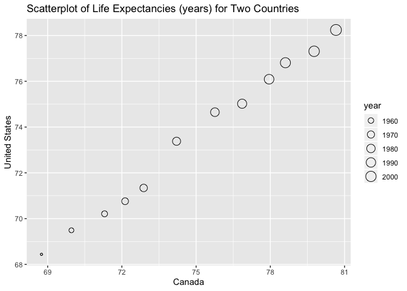

## Introduction

For this analysis, we load the `gapminder`, `tidyverse`, `knitrr` and `DT` packages.  The code to load these packages is not displayed in the report.  Data wrangling is performed on the gapminder dataset.  In this report, I have chosen the following:

  * [__Univariate Option 1__](#exercise-1---univariate-option-1) - Using the gapminder dataset, we make a new tibble with one row per year and two columns containing the life expectancies for two countries, use this new tibble to make a scatterplot of the life expectancies, and then re-lengthen the data.
  * [__Multivariate Option 1__](#exercise-2---multivariate-option-1) - Using the gapminder dataset, we make a tibble with one row per year and columns for both life expectancies and GDP per capita for two countries and then re-lengthen the data.
  * [__Exercise 3__](#exercise-3---table-joins) - 


```r
suppressPackageStartupMessages(library(gapminder)) # for gapminder dataset
suppressPackageStartupMessages(library(tidyverse)) #loads ggplot2, tibble, tidyr, dplyr packages
suppressPackageStartupMessages(library(DT)) #for datatable() command to display datatables
suppressPackageStartupMessages(library(knitr)) #for kable() command
```

## Exercise 1 - Univariate Option 1

### Make a Tibble

Observations in the `gapminder::gapminder` dataset can be defined as country/year.  Thus, the dataset can be considered tidy since each row corresponds to one country/year observation.  In this section, we make a tibble with one row per year and columns for life expectancy for two or more countries.  The countries used are Canada and United States.


```r
can.us <- gapminder %>% 
  #filter to Canada and United States
  filter(country == "Canada" | country == "United States") %>% 
  #select year, country, and life expectancy columns
  select(year, country, lifeExp) %>% 
  # Transform tibble with year, country, and lifeExp columns to year, Canada and United States with life expectancies
  pivot_wider(id_cols = year,
              names_from = country,
              values_from = lifeExp)

datatable(can.us, caption=tab.cap[1])
```

<!--html_preserve--><div id="htmlwidget-617d9929c2e72bc63be1" style="width:100%;height:auto;" class="datatables html-widget"></div>
<script type="application/json" data-for="htmlwidget-617d9929c2e72bc63be1">{"x":{"filter":"none","caption":"<caption>Table 1: Life expectancies (years) for Canada and the United States<\/caption>","data":[["1","2","3","4","5","6","7","8","9","10","11","12"],[1952,1957,1962,1967,1972,1977,1982,1987,1992,1997,2002,2007],[68.75,69.96,71.3,72.13,72.88,74.21,75.76,76.86,77.95,78.61,79.77,80.653],[68.44,69.49,70.21,70.76,71.34,73.38,74.65,75.02,76.09,76.81,77.31,78.242]],"container":"<table class=\"display\">\n  <thead>\n    <tr>\n      <th> <\/th>\n      <th>year<\/th>\n      <th>Canada<\/th>\n      <th>United States<\/th>\n    <\/tr>\n  <\/thead>\n<\/table>","options":{"columnDefs":[{"className":"dt-right","targets":[1,2,3]},{"orderable":false,"targets":0}],"order":[],"autoWidth":false,"orderClasses":false}},"evals":[],"jsHooks":[]}</script><!--/html_preserve-->

### Scatterplot

In this section, we use the new tibble `can.us` to produce a scatterplot of the life expectancy of Canada versus the life expectancy of the United States.  Note that since the column "United States" has a space in the middle, the code uses backticks, \`, so that the aesthetics are properly mapped.


```r
can.us %>% 
  ggplot(aes(Canada, `United States`)) +
  geom_point() +
  ggtitle(label='Life Expectancies (years)')
```



### Re-lengthen 

In this step, the `can.us` tibble is re-lengthened.


```r
can.us %>% 
  pivot_longer(cols = c("Canada",
                        "United States"),
               names_to = "country",
               values_to = "lifeExp") %>% 
  arrange(country) %>% 
  datatable(caption=tab.cap[2])
```

<!--html_preserve--><div id="htmlwidget-e91b171b96e78080ef2d" style="width:100%;height:auto;" class="datatables html-widget"></div>
<script type="application/json" data-for="htmlwidget-e91b171b96e78080ef2d">{"x":{"filter":"none","caption":"<caption>Table 2: Re-lengthened dataset for life expectancies for Canada and the United States<\/caption>","data":[["1","2","3","4","5","6","7","8","9","10","11","12","13","14","15","16","17","18","19","20","21","22","23","24"],[1952,1957,1962,1967,1972,1977,1982,1987,1992,1997,2002,2007,1952,1957,1962,1967,1972,1977,1982,1987,1992,1997,2002,2007],["Canada","Canada","Canada","Canada","Canada","Canada","Canada","Canada","Canada","Canada","Canada","Canada","United States","United States","United States","United States","United States","United States","United States","United States","United States","United States","United States","United States"],[68.75,69.96,71.3,72.13,72.88,74.21,75.76,76.86,77.95,78.61,79.77,80.653,68.44,69.49,70.21,70.76,71.34,73.38,74.65,75.02,76.09,76.81,77.31,78.242]],"container":"<table class=\"display\">\n  <thead>\n    <tr>\n      <th> <\/th>\n      <th>year<\/th>\n      <th>country<\/th>\n      <th>lifeExp<\/th>\n    <\/tr>\n  <\/thead>\n<\/table>","options":{"columnDefs":[{"className":"dt-right","targets":[1,3]},{"orderable":false,"targets":0}],"order":[],"autoWidth":false,"orderClasses":false}},"evals":[],"jsHooks":[]}</script><!--/html_preserve-->

## Exercise 2 - Multivariate Option 1

### Make a Tibble

In this section, we make a tibble with one row per year and columns for both life expectancy and GDP per capita for two unique countries.  The countries chosen are China and India.  Both life expectancy and GDP per capita are rounded to two decimal places.


```r
ch.in <- gapminder %>% 
  filter(country == "China" |
           country == "India") %>% 
  select(country, year, lifeExp, gdpPercap) %>% 
  pivot_wider(id_cols = year,
              names_from = country,
              values_from = c(lifeExp, gdpPercap)) %>% 
  mutate_at(vars(-year), ~round(., 2))

datatable(ch.in, caption=tab.cap[3])
```

<!--html_preserve--><div id="htmlwidget-1079d4093ac58a41268c" style="width:100%;height:auto;" class="datatables html-widget"></div>
<script type="application/json" data-for="htmlwidget-1079d4093ac58a41268c">{"x":{"filter":"none","caption":"<caption>Table 3: Life expectancies (years) and GDP per capitas ($US-inflation adjusted) for China and India<\/caption>","data":[["1","2","3","4","5","6","7","8","9","10","11","12"],[1952,1957,1962,1967,1972,1977,1982,1987,1992,1997,2002,2007],[44,50.55,44.5,58.38,63.12,63.97,65.53,67.27,68.69,70.43,72.03,72.96],[37.37,40.25,43.6,47.19,50.65,54.21,56.6,58.55,60.22,61.77,62.88,64.7],[400.45,575.99,487.67,612.71,676.9,741.24,962.42,1378.9,1655.78,2289.23,3119.28,4959.11],[546.57,590.06,658.35,700.77,724.03,813.34,855.72,976.51,1164.41,1458.82,1746.77,2452.21]],"container":"<table class=\"display\">\n  <thead>\n    <tr>\n      <th> <\/th>\n      <th>year<\/th>\n      <th>lifeExp_China<\/th>\n      <th>lifeExp_India<\/th>\n      <th>gdpPercap_China<\/th>\n      <th>gdpPercap_India<\/th>\n    <\/tr>\n  <\/thead>\n<\/table>","options":{"columnDefs":[{"className":"dt-right","targets":[1,2,3,4,5]},{"orderable":false,"targets":0}],"order":[],"autoWidth":false,"orderClasses":false}},"evals":[],"jsHooks":[]}</script><!--/html_preserve-->

### Re-lengthen

In this section, we re-lengthen the data so that each row's observation is defined as the year/country intersection.  Since we have 2 countries and 12 years, the re-lengthened data has a total of 24 rows instead of the 12 rows as in the tibble from the previous section.


```r
ch.in %>% 
  pivot_longer(cols = -year,
               names_to = c(".value", "country"),
               names_sep = "_") %>% 
  datatable(caption=tab.cap[4])
```

<!--html_preserve--><div id="htmlwidget-3661fef8e20454aed7a8" style="width:100%;height:auto;" class="datatables html-widget"></div>
<script type="application/json" data-for="htmlwidget-3661fef8e20454aed7a8">{"x":{"filter":"none","caption":"<caption>Table 4: Re-lengthed dataset from Table 3<\/caption>","data":[["1","2","3","4","5","6","7","8","9","10","11","12","13","14","15","16","17","18","19","20","21","22","23","24"],[1952,1952,1957,1957,1962,1962,1967,1967,1972,1972,1977,1977,1982,1982,1987,1987,1992,1992,1997,1997,2002,2002,2007,2007],["China","India","China","India","China","India","China","India","China","India","China","India","China","India","China","India","China","India","China","India","China","India","China","India"],[44,37.37,50.55,40.25,44.5,43.6,58.38,47.19,63.12,50.65,63.97,54.21,65.53,56.6,67.27,58.55,68.69,60.22,70.43,61.77,72.03,62.88,72.96,64.7],[400.45,546.57,575.99,590.06,487.67,658.35,612.71,700.77,676.9,724.03,741.24,813.34,962.42,855.72,1378.9,976.51,1655.78,1164.41,2289.23,1458.82,3119.28,1746.77,4959.11,2452.21]],"container":"<table class=\"display\">\n  <thead>\n    <tr>\n      <th> <\/th>\n      <th>year<\/th>\n      <th>country<\/th>\n      <th>lifeExp<\/th>\n      <th>gdpPercap<\/th>\n    <\/tr>\n  <\/thead>\n<\/table>","options":{"columnDefs":[{"className":"dt-right","targets":[1,3,4]},{"orderable":false,"targets":0}],"order":[],"autoWidth":false,"orderClasses":false}},"evals":[],"jsHooks":[]}</script><!--/html_preserve-->
As you can see from the above tibble, we've recreated the long-form data set that we originally started with!

## Exercise 3 - Table Joins

We begin by importing made-up wedding guestlist and e-mail addresses using the `read_csv()` function from the `readr` package which is automatically loaded with the `tidyverse` package.


```r
guest <- read_csv("https://raw.githubusercontent.com/STAT545-UBC/Classroom/master/data/wedding/attend.csv")
email <- read_csv("https://raw.githubusercontent.com/STAT545-UBC/Classroom/master/data/wedding/emails.csv")
```

### 3.1 - Add E-mail Column

For each guest in the guestlist (tibble `guest`), we add a column for the e-mail address.  We do this by first separating rows by `, `, since the names of all guests from the same party are on the same line separated by a comma in the `email` tibble.  The `separate_rows()` function is designed for this specific purpose. Once we modify the `email` tibble in this way, we can compare it to `guest` tibble using the `right_join()` function.


```r
#First separate rows in email tibble to get one guest per row
guest.email <- email %>% 
  separate_rows(guest, sep = ", ") %>% 
  right_join(guest, by=c("guest" = "name"))

datatable(guest.email, caption=tab.cap[5])
```

<!--html_preserve--><div id="htmlwidget-70e0ceb15f64aea1900b" style="width:100%;height:auto;" class="datatables html-widget"></div>
<script type="application/json" data-for="htmlwidget-70e0ceb15f64aea1900b">{"x":{"filter":"none","caption":"<caption>Table 5: Guest list with e-mails where available<\/caption>","data":[["1","2","3","4","5","6","7","8","9","10","11","12","13","14","15","16","17","18","19","20","21","22","23","24","25","26","27","28","29","30"],["Sommer Medrano","Phillip Medrano","Blanka Medrano","Emaan Medrano","Blair Park","Nigel Webb","Sinead English","Ayra Marks","Atlanta Connolly","Denzel Connolly","Chanelle Shah","Jolene Welsh","Hayley Booker","Amayah Sanford","Erika Foley","Ciaron Acosta","Diana Stuart","Cosmo Dunkley","Cai Mcdaniel","Daisy-May Caldwell","Martin Caldwell","Violet Caldwell","Nazifa Caldwell","Eric Caldwell","Rosanna Bird","Kurtis Frost","Huma Stokes","Samuel Rutledge","Eddison Collier","Stewart Nicholls"],["sommm@gmail.com","sommm@gmail.com","sommm@gmail.com","sommm@gmail.com","bpark@gmail.com","bpark@gmail.com","singlish@hotmail.ca","marksa42@gmail.com",null,null,null,"jw1987@hotmail.com","jw1987@hotmail.com","erikaaaaaa@gmail.com","erikaaaaaa@gmail.com","shining_ciaron@gmail.com","doodledianastu@gmail.com",null,null,"caldwellfamily5212@gmail.com","caldwellfamily5212@gmail.com","caldwellfamily5212@gmail.com","caldwellfamily5212@gmail.com","caldwellfamily5212@gmail.com","rosy1987b@gmail.com","rosy1987b@gmail.com","humastokes@gmail.com","humastokes@gmail.com","eddison.collier@gmail.com","eddison.collier@gmail.com"],[1,1,1,1,2,2,3,4,5,5,5,6,6,7,7,8,9,10,11,12,12,12,12,12,13,13,14,14,15,15],["PENDING","vegetarian","chicken","PENDING","chicken",null,"PENDING","vegetarian","PENDING","fish","chicken",null,"vegetarian",null,"PENDING","PENDING","vegetarian","PENDING","fish","chicken","PENDING","PENDING","chicken","chicken","vegetarian","PENDING",null,"chicken","PENDING","chicken"],["PENDING","Menu C","Menu A","PENDING","Menu C",null,"PENDING","Menu B","PENDING","Menu B","Menu C",null,"Menu C","PENDING","PENDING","Menu A","Menu C","PENDING","Menu C","Menu B","PENDING","PENDING","PENDING","Menu B","Menu C","PENDING",null,"Menu C","PENDING","Menu B"],["PENDING","CONFIRMED","CONFIRMED","PENDING","CONFIRMED","CANCELLED","PENDING","PENDING","PENDING","CONFIRMED","CONFIRMED","CANCELLED","CONFIRMED","CANCELLED","PENDING","PENDING","CONFIRMED","PENDING","CONFIRMED","CONFIRMED","PENDING","PENDING","PENDING","CONFIRMED","CONFIRMED","PENDING","CANCELLED","CONFIRMED","PENDING","CONFIRMED"],["PENDING","CONFIRMED","CONFIRMED","PENDING","CONFIRMED","CANCELLED","PENDING","PENDING","PENDING","CONFIRMED","CONFIRMED","CANCELLED","CONFIRMED","PENDING","PENDING","PENDING","CONFIRMED","PENDING","CONFIRMED","CONFIRMED","PENDING","PENDING","PENDING","CONFIRMED","CONFIRMED","PENDING","CANCELLED","CONFIRMED","PENDING","CONFIRMED"],["PENDING","CONFIRMED","CONFIRMED","PENDING","CONFIRMED","CANCELLED","PENDING","PENDING","PENDING","CONFIRMED","CONFIRMED","CANCELLED","CONFIRMED","PENDING","PENDING","PENDING","CONFIRMED","PENDING","CONFIRMED","CONFIRMED","PENDING","PENDING","PENDING","CONFIRMED","CONFIRMED","PENDING","CANCELLED","CONFIRMED","PENDING","CONFIRMED"]],"container":"<table class=\"display\">\n  <thead>\n    <tr>\n      <th> <\/th>\n      <th>guest<\/th>\n      <th>email<\/th>\n      <th>party<\/th>\n      <th>meal_wedding<\/th>\n      <th>meal_brunch<\/th>\n      <th>attendance_wedding<\/th>\n      <th>attendance_brunch<\/th>\n      <th>attendance_golf<\/th>\n    <\/tr>\n  <\/thead>\n<\/table>","options":{"columnDefs":[{"className":"dt-right","targets":3},{"orderable":false,"targets":0}],"order":[],"autoWidth":false,"orderClasses":false}},"evals":[],"jsHooks":[]}</script><!--/html_preserve-->

We see that there are 5 guests that do not have an e-mail address in the `email` tibble.  These guests are 

Table: Table 6: Guests from the guest list with no e-mail available

|guest            |
|:----------------|
|Atlanta Connolly |
|Denzel Connolly  |
|Chanelle Shah    |
|Cosmo Dunkley    |
|Cai Mcdaniel     |


### 3.2 - E-mails not on Guestlist

In this section, we find e-mails in our e-mail list (tibble `email`) for persons not on the guestlist.  This is similar to Exercise 3.1, but instead of using the `left_join()` or `right_join()` functions, we use `anti_join()`, which returns all rows from a tibble that do not match values in another tibble.


```r
email.only <- email %>%
  separate_rows(guest, sep=", ") %>% 
  anti_join(guest, by=c("guest" = "name"))

datatable(email.only, caption=tab.cap[7])
```

<!--html_preserve--><div id="htmlwidget-527c4d68e26c2a3668af" style="width:100%;height:auto;" class="datatables html-widget"></div>
<script type="application/json" data-for="htmlwidget-527c4d68e26c2a3668af">{"x":{"filter":"none","caption":"<caption>Table 7: Names of people with e-mails available that are not on the guest list<\/caption>","data":[["1","2","3"],["Turner Jones","Albert Marshall","Vivian Marshall"],["tjjones12@hotmail.ca","themarshallfamily1234@gmail.com","themarshallfamily1234@gmail.com"]],"container":"<table class=\"display\">\n  <thead>\n    <tr>\n      <th> <\/th>\n      <th>guest<\/th>\n      <th>email<\/th>\n    <\/tr>\n  <\/thead>\n<\/table>","options":{"order":[],"autoWidth":false,"orderClasses":false,"columnDefs":[{"orderable":false,"targets":0}]}},"evals":[],"jsHooks":[]}</script><!--/html_preserve-->


### 3.3 - Expand Guestlist
In this section, we combine the guest list with the e-mail list so that each name appears exactly once in a new tibble.


```r
guest.email %>%
  bind_rows(email.only) %>% 
datatable(caption=tab.cap[8])
```

<!--html_preserve--><div id="htmlwidget-1ae315ed6b1e3b32d85c" style="width:100%;height:auto;" class="datatables html-widget"></div>
<script type="application/json" data-for="htmlwidget-1ae315ed6b1e3b32d85c">{"x":{"filter":"none","caption":"<caption>Table 8: Combined tibble of all people either on the guest list or the e-mail list<\/caption>","data":[["1","2","3","4","5","6","7","8","9","10","11","12","13","14","15","16","17","18","19","20","21","22","23","24","25","26","27","28","29","30","31","32","33"],["Sommer Medrano","Phillip Medrano","Blanka Medrano","Emaan Medrano","Blair Park","Nigel Webb","Sinead English","Ayra Marks","Atlanta Connolly","Denzel Connolly","Chanelle Shah","Jolene Welsh","Hayley Booker","Amayah Sanford","Erika Foley","Ciaron Acosta","Diana Stuart","Cosmo Dunkley","Cai Mcdaniel","Daisy-May Caldwell","Martin Caldwell","Violet Caldwell","Nazifa Caldwell","Eric Caldwell","Rosanna Bird","Kurtis Frost","Huma Stokes","Samuel Rutledge","Eddison Collier","Stewart Nicholls","Turner Jones","Albert Marshall","Vivian Marshall"],["sommm@gmail.com","sommm@gmail.com","sommm@gmail.com","sommm@gmail.com","bpark@gmail.com","bpark@gmail.com","singlish@hotmail.ca","marksa42@gmail.com",null,null,null,"jw1987@hotmail.com","jw1987@hotmail.com","erikaaaaaa@gmail.com","erikaaaaaa@gmail.com","shining_ciaron@gmail.com","doodledianastu@gmail.com",null,null,"caldwellfamily5212@gmail.com","caldwellfamily5212@gmail.com","caldwellfamily5212@gmail.com","caldwellfamily5212@gmail.com","caldwellfamily5212@gmail.com","rosy1987b@gmail.com","rosy1987b@gmail.com","humastokes@gmail.com","humastokes@gmail.com","eddison.collier@gmail.com","eddison.collier@gmail.com","tjjones12@hotmail.ca","themarshallfamily1234@gmail.com","themarshallfamily1234@gmail.com"],[1,1,1,1,2,2,3,4,5,5,5,6,6,7,7,8,9,10,11,12,12,12,12,12,13,13,14,14,15,15,null,null,null],["PENDING","vegetarian","chicken","PENDING","chicken",null,"PENDING","vegetarian","PENDING","fish","chicken",null,"vegetarian",null,"PENDING","PENDING","vegetarian","PENDING","fish","chicken","PENDING","PENDING","chicken","chicken","vegetarian","PENDING",null,"chicken","PENDING","chicken",null,null,null],["PENDING","Menu C","Menu A","PENDING","Menu C",null,"PENDING","Menu B","PENDING","Menu B","Menu C",null,"Menu C","PENDING","PENDING","Menu A","Menu C","PENDING","Menu C","Menu B","PENDING","PENDING","PENDING","Menu B","Menu C","PENDING",null,"Menu C","PENDING","Menu B",null,null,null],["PENDING","CONFIRMED","CONFIRMED","PENDING","CONFIRMED","CANCELLED","PENDING","PENDING","PENDING","CONFIRMED","CONFIRMED","CANCELLED","CONFIRMED","CANCELLED","PENDING","PENDING","CONFIRMED","PENDING","CONFIRMED","CONFIRMED","PENDING","PENDING","PENDING","CONFIRMED","CONFIRMED","PENDING","CANCELLED","CONFIRMED","PENDING","CONFIRMED",null,null,null],["PENDING","CONFIRMED","CONFIRMED","PENDING","CONFIRMED","CANCELLED","PENDING","PENDING","PENDING","CONFIRMED","CONFIRMED","CANCELLED","CONFIRMED","PENDING","PENDING","PENDING","CONFIRMED","PENDING","CONFIRMED","CONFIRMED","PENDING","PENDING","PENDING","CONFIRMED","CONFIRMED","PENDING","CANCELLED","CONFIRMED","PENDING","CONFIRMED",null,null,null],["PENDING","CONFIRMED","CONFIRMED","PENDING","CONFIRMED","CANCELLED","PENDING","PENDING","PENDING","CONFIRMED","CONFIRMED","CANCELLED","CONFIRMED","PENDING","PENDING","PENDING","CONFIRMED","PENDING","CONFIRMED","CONFIRMED","PENDING","PENDING","PENDING","CONFIRMED","CONFIRMED","PENDING","CANCELLED","CONFIRMED","PENDING","CONFIRMED",null,null,null]],"container":"<table class=\"display\">\n  <thead>\n    <tr>\n      <th> <\/th>\n      <th>guest<\/th>\n      <th>email<\/th>\n      <th>party<\/th>\n      <th>meal_wedding<\/th>\n      <th>meal_brunch<\/th>\n      <th>attendance_wedding<\/th>\n      <th>attendance_brunch<\/th>\n      <th>attendance_golf<\/th>\n    <\/tr>\n  <\/thead>\n<\/table>","options":{"columnDefs":[{"className":"dt-right","targets":3},{"orderable":false,"targets":0}],"order":[],"autoWidth":false,"orderClasses":false}},"evals":[],"jsHooks":[]}</script><!--/html_preserve-->


