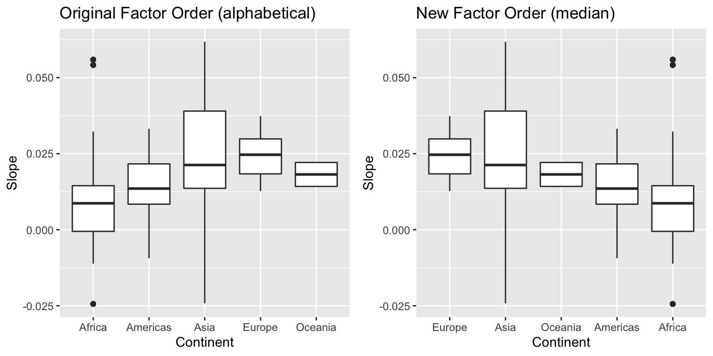
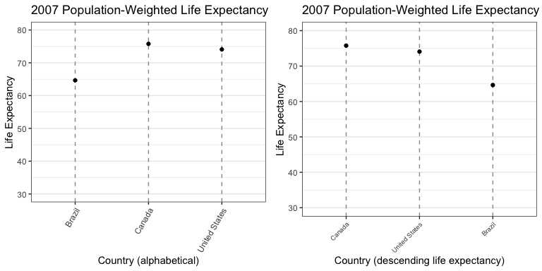
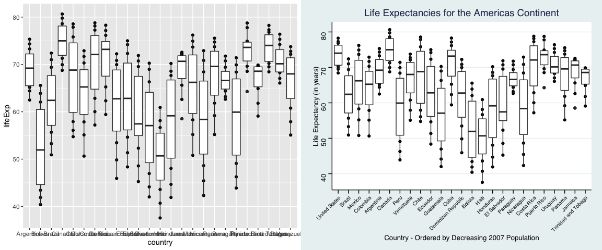

<br>

---
  
## 1. Value of here::here
  
> *Read through the [blog post](https://malco.io/2018/11/05/why-should-i-use-the-here-package-when-i-m-already-using-projects/) by Malcolm Barrett where he outlines why one should use the here::here package in RStudio projects.*
>
> *Task: * ***In your own words****, summarize the value of the here::here package in 250 words or fewer.*

To explain the usefulness of the `here` package, we first must introduce the idea of `R` projects.  Benefits of using `R` projects are to

  - divide work into specific projects,
  - use each project's directory as the working directory by default, and
  - manage the settings of a project to open a fresh `R` session with an empty global environment and no packages loaded.

The `here` package takes advantage of the second bullet point by offering a simple set of functions that detects the project's root directory and works with paths within that directory in a platform-independent way so that the `R` code is not affected by the user's operating system.  Additionally, `here`

  - works when `*.R` files are open in a session outside of a project,
  - gives precedence to a project's directory over a working directory,
  - still allows code to run even when files are moved.

---

<br>

---
  
## 2. Factor Management
  
> *Task: Choose one dataset (of your choice) and a variable to explore.*
  
I work with the `gapminder` dataset and the continent variable, which is set as a factor.


```r
class(gapminder$continent)
```

```
## [1] "factor"
```
  
> *1. Drop Oceania. Filter the Gapminder data to remove observations associated with the `continent` of Oceania. Additionally, remove unused factor levels. Provide concrete information on the data before and after removing these rows and Oceania; address the number of rows and the levels of the affected factors.*
  
Removing observations associated with values in a column is easily done via the `dplyr::filter()` command.  We create a new tibble called `noOc` which filters all observations with `continent=="Oceania"` from gapminder.

```r
noOc <- gapminder %>% 
  filter(continent != 'Oceania')
```

The number of rows in the `noOc` dataset is 1680, as compared to `gapminder` which has 1704 rows.  Filtering does not change the levels of a factor or the order of the levels.  The `continent` column from `gapminder` has 5 levels and `noOc` has 5 levels.


```r
kable(cbind(levels(gapminder$continent),
            levels(noOc$continent)),
      col.names=c("Gapminder Dataset", "Filtered noOc Dataset"),
      caption=tab.cap[1])
```


Table: Table 1: The factor levels and their orders for continent are the same in the gapminder dataset and the filtered noOc dataset

Gapminder Dataset   Filtered noOc Dataset 
------------------  ----------------------
Africa              Africa                
Americas            Americas              
Asia                Asia                  
Europe              Europe                
Oceania             Oceania               

"Oceania" is a factor level not included in the `noOc` dataset.  To remove it, we use the `droplevels()` function and create a new `noOc.drop` dataset.


```r
noOc.drop <- noOc %>% 
  droplevels()

kable(cbind(levels(gapminder$continent),
            levels(noOc$continent),
            c(levels(noOc.drop$continent), "")),
      col.names=c("Gapminder Dataset", "Filtered noOc Dataset", "Drop-Level noOc.drop Dataset"),
      caption=tab.cap[2])
```


Table: Table 2: The factor level orders for continent in the gapminder dataset, the filtered noOc dataset, and the drop-level noOc.drop dataset: filtering does not remove unused levels while droplevels() does

Gapminder Dataset   Filtered noOc Dataset   Drop-Level noOc.drop Dataset 
------------------  ----------------------  -----------------------------
Africa              Africa                  Africa                       
Americas            Americas                Americas                     
Asia                Asia                    Asia                         
Europe              Europe                  Europe                       
Oceania             Oceania                                              

Dropping levels does not affect the number of observations, since it only drops unused factors.  The number of rows in `noOc` is 1680 and the number of rows in `noOc.drop` is 1680.

In summary, 

Dataset | **`gapminder`** | **`noOc`** | **`noOc.drop`** |
--------|-------------|--------|-------------|
Number of Rows | 1704 | 1680 | 1680 |
Number of Levels | 5 | 5 | 4 |
Levels | Africa, Americas, Asia, Europe, Oceania | Africa, Americas, Asia, Europe, Oceania | Africa, Americas, Asia, Europe |
Table: Table 3: Summary of number of observations and levels for the original gapminder dataset, the removal of "Oceania" observations, and dropping the "Oceania" factor level


> *2. Reorder the levels of country or continent. Use the forcats package to change the order of the factor levels, based on summarized information of one of the quantitative variables. Consider experimenting with a summary statistic beyond the most basic choice of the mean/median. Use the forcats package in the tidyverse for this, rather than the baseR function as.factor.* 
  
For each country, we calculate the simple linear regression slope of the natural logarithm of gdpPercap against year.  Using the `forcats::fct_reorder()` function, we reorder the continent factor descendingly by its median country-level regression slope coefficient.  Note that the `forcats` package is automatically loaded into `R` when loading `tidyverse`.


```r
# Add column for country regression slope
gap.growth <- gapminder %>% 
  group_by(country) %>% 
  mutate(growth = cor(year, log(gdpPercap))*sd(log(gdpPercap))/sd(year))
  
# Default ordering
p1 <- gap.growth %>% 
  ggplot(aes(x=continent, y=growth)) + 
  geom_boxplot() + 
  xlab("Continent") +
  ylab("Slope") +
  ggtitle(label="Original Factor Order (alphabetical)") +
  theme_bw()

# Order by largest slope
p2 <- gap.growth %>% 
  ggplot(aes(x=fct_reorder(continent, -growth, median), y=growth)) +
  geom_boxplot() + 
  xlab("Continent") +
  ylab("Slope") +
  ggtitle(label="New Factor Order (descending median)") +
  theme_bw()

# Compare continent factor orderings for boxplots
grid.arrange(p1, p2, nrow=1)
```




```r
# Change factor level ordering for gap.growth
kable(cbind(levels(gap.growth$continent),
            levels(with(gap.growth, fct_reorder(continent, -growth, median)))),
      col.names=c("Alphabetical (Default)", "Descending by Median Slope"),
      caption=tab.cap[4])
```


Table: Table 4: Default ordering of the continent factor levels is alphabetical and presented in the first column. The new factor level order is descending median regression slope and is presented in the second column.

Alphabetical (Default)   Descending by Median Slope 
-----------------------  ---------------------------
Africa                   Europe                     
Americas                 Asia                       
Asia                     Oceania                    
Europe                   Americas                   
Oceania                  Africa                     

---

<br>

---
  
## 3: File Input/Output
> *Task: Experiment with at least one of:*
>  
>  - *write_csv()/read_csv() (and/or TSV friends)*,
>  - *saveRDS()/readRDS()*,
>  - *dput()/dget()*.
>  
> *You are expected to create something new, probably by filtering or grouped-summarization of your dataset (for e.g., Singer, Gapminder, or another dataset), export it to disk and then reload it back in using one of the packages above. You should use `here::here()` for reading in and writing out.*
  
Using the gapminder dataset, we calculate the population-weighted moving average life expectancy for each country from 1952 to each year and filter our dataset to the countries Canada, United States, and Brazil.  We then export the country, continent, year, and moving average life expectancy from gapminder to `gap-hw5.csv` using the `readr::write_csv()` function.  The data is imported back into `R` using the `readr::read_csv()` function.  The file path is designated by the `here::here()` function. The `readr` package is automatically loaded when `tidyverse` is loaded.


```r
# Population-weighted moving average function
w.avg <- function(x, w, t) {
  #x is the data to be averaged
  #w is the data by which to weight
  #t is the time column by which we roll the weighted mean
  ans <- numeric(length(x))
  for (i in seq_along(t)) {
    ans[i] <- weighted.mean(x=x[1:i], w=w[1:i])
  }
  return(ans)
}
#Create new column
gap.wavg <- gapminder %>% 
  filter(country == "Canada" |
           country == "United States" |
           country == "Brazil") %>% 
  group_by(country) %>% 
  mutate(wavg.lifeExp = w.avg(x=lifeExp, w=pop, t=year)) %>% 
  select(country, continent, year, lifeExp, wavg.lifeExp)
  
#working directory is project's directory
file.name <- here::here("hw05", "hw05_files", "gap-hw5.csv")

#export csv to disc
write_csv(gap.wavg, file.name)

#re-import csv file
gap.hw5 <- read_csv(file.name) %>% 
  mutate(country = factor(country)) %>% 
  mutate(continent = factor(continent))
```

```
## Parsed with column specification:
## cols(
##   country = col_character(),
##   continent = col_character(),
##   year = col_double(),
##   lifeExp = col_double(),
##   wavg.lifeExp = col_double()
## )
```

  
> *With the imported data, play around with factor levels and use factors to order your data with one of your factors (i.e. non-alphabetically).*
  
We reimporting the csv file to the `gap.hw5` tibble, we declared `country` a factor and ordered it alphabetically (the default ordering).  We then reorder the factor levels of `gap.hw5$country` using the `forcats::fct_reorder()` function so that they are ordered descendingly by population-weighted life expectancy for each country as of 2007.  Figure 2 shows the factor levels before and after reordering.


```r
p1 <- gap.hw5 %>% 
  filter(country %in% levels(country)[1:10]) %>% 
  group_by(country) %>% 
  summarize(last.life = last(wavg.lifeExp)) %>% 
  ggplot(aes(x=country, y=last.life)) +
  geom_point() +
  theme_bw() + 
  theme(panel.grid.major.x = element_line(colour="grey60", linetype="dashed"),
        axis.text.x = element_text(angle=60, vjust=1, hjust=1)) + 
  ylab("Life Expectancy") +
  ylim(30, 80) + 
  xlab("Country (alphabetical)") +
  ggtitle("2007 Population-Weighted Life Expectancy")

p2 <- gap.hw5 %>% 
  mutate(country = fct_reorder(country, -wavg.lifeExp, .fun=last)) %>% 
  filter(country %in% levels(country)[1:10]) %>% 
  group_by(country) %>% 
  summarize(last.life = last(wavg.lifeExp)) %>% 
  ggplot(aes(x=country, y=last.life)) +
  geom_point() +
  theme_bw() + 
  theme(panel.grid.major.x = element_line(colour="grey60", linetype="dashed"),
        axis.text.x = element_text(angle=45, vjust=1, hjust=1, size=rel(0.8))) + 
  ylab("Life Expectancy") +
  ylim(30, 80) + 
  xlab("Country (descending life expectancy)") +
  ggtitle("2007 Population-Weighted Life Expectancy")

grid.arrange(p1, p2, nrow=1)
```



> *For the I/O method(s) you chose, comment on whether or not your newly created file survived the round trip of writing to file then reading back in.*

The newly created file survived the round trip of writing data to file and being read back into `R` which can be seen by comparing the datasets `gap.wavg`, which is presented in Table 5 and written to disc, and the `gap.hw5` dataset presented in Table 6 after importing the data from a `*.csv` file.  It should be noted that the reimported data does not preserve the factor data type for country and continent and imports them as character strings.  Thus after importing, I use `mutate(country = factor(country))` and `mutate(country = factor(country))` to declare these columns as factors.


```r
#Data written to csv
gap.wavg %>% 
  mutate_at(.vars=c("lifeExp", "wavg.lifeExp"), .funs=~round(., digits=2)) %>% 
  datatable(caption=tab.cap[5])
```

<!--html_preserve--><div id="htmlwidget-ffe8f5cd0e94e8455e74" style="width:100%;height:auto;" class="datatables html-widget"></div>
<script type="application/json" data-for="htmlwidget-ffe8f5cd0e94e8455e74">{"x":{"filter":"none","caption":"<caption>Table 5: Data written to csv<\/caption>","data":[["1","2","3","4","5","6","7","8","9","10","11","12","13","14","15","16","17","18","19","20","21","22","23","24","25","26","27","28","29","30","31","32","33","34","35","36"],["Brazil","Brazil","Brazil","Brazil","Brazil","Brazil","Brazil","Brazil","Brazil","Brazil","Brazil","Brazil","Canada","Canada","Canada","Canada","Canada","Canada","Canada","Canada","Canada","Canada","Canada","Canada","United States","United States","United States","United States","United States","United States","United States","United States","United States","United States","United States","United States"],["Americas","Americas","Americas","Americas","Americas","Americas","Americas","Americas","Americas","Americas","Americas","Americas","Americas","Americas","Americas","Americas","Americas","Americas","Americas","Americas","Americas","Americas","Americas","Americas","Americas","Americas","Americas","Americas","Americas","Americas","Americas","Americas","Americas","Americas","Americas","Americas"],[1952,1957,1962,1967,1972,1977,1982,1987,1992,1997,2002,2007,1952,1957,1962,1967,1972,1977,1982,1987,1992,1997,2002,2007,1952,1957,1962,1967,1972,1977,1982,1987,1992,1997,2002,2007],[50.92,53.28,55.66,57.63,59.5,61.49,63.34,65.2,67.06,69.39,71.01,72.39,68.75,69.96,71.3,72.13,72.88,74.21,75.76,76.86,77.95,78.61,79.77,80.65,68.44,69.49,70.21,70.76,71.34,73.38,74.65,75.02,76.09,76.81,77.31,78.24],[50.92,52.19,53.52,54.79,56.02,57.26,58.51,59.74,60.97,62.26,63.49,64.65,68.75,69.4,70.11,70.7,71.21,71.82,72.52,73.2,73.88,74.51,75.15,75.78,68.44,68.99,69.43,69.8,70.15,70.77,71.42,71.96,72.53,73.07,73.57,74.09]],"container":"<table class=\"display\">\n  <thead>\n    <tr>\n      <th> <\/th>\n      <th>country<\/th>\n      <th>continent<\/th>\n      <th>year<\/th>\n      <th>lifeExp<\/th>\n      <th>wavg.lifeExp<\/th>\n    <\/tr>\n  <\/thead>\n<\/table>","options":{"columnDefs":[{"className":"dt-right","targets":[3,4,5]},{"orderable":false,"targets":0}],"order":[],"autoWidth":false,"orderClasses":false}},"evals":[],"jsHooks":[]}</script><!--/html_preserve-->

```r
# Create file name and directory for output
file.name <- here::here("hw05", "hw05_files", "gap-hw5.csv")

# Export data as csv
write_csv(gap.wavg, file.name)

# Data imported from csv
gap.hw5 <- read_csv(file.name)
```

```
## Parsed with column specification:
## cols(
##   country = col_character(),
##   continent = col_character(),
##   year = col_double(),
##   lifeExp = col_double(),
##   wavg.lifeExp = col_double()
## )
```

```r
gap.hw5 %>% 
  mutate(country = factor(country)) %>% 
  mutate(continent = factor(continent)) %>% 
  mutate_at(.vars=c("lifeExp", "wavg.lifeExp"), .funs=~round(., digits=2)) %>% 
  datatable(caption=tab.cap[6])
```

<!--html_preserve--><div id="htmlwidget-58906bde58b34cdce5c8" style="width:100%;height:auto;" class="datatables html-widget"></div>
<script type="application/json" data-for="htmlwidget-58906bde58b34cdce5c8">{"x":{"filter":"none","caption":"<caption>Table 6: Data imported from csv<\/caption>","data":[["1","2","3","4","5","6","7","8","9","10","11","12","13","14","15","16","17","18","19","20","21","22","23","24","25","26","27","28","29","30","31","32","33","34","35","36"],["Brazil","Brazil","Brazil","Brazil","Brazil","Brazil","Brazil","Brazil","Brazil","Brazil","Brazil","Brazil","Canada","Canada","Canada","Canada","Canada","Canada","Canada","Canada","Canada","Canada","Canada","Canada","United States","United States","United States","United States","United States","United States","United States","United States","United States","United States","United States","United States"],["Americas","Americas","Americas","Americas","Americas","Americas","Americas","Americas","Americas","Americas","Americas","Americas","Americas","Americas","Americas","Americas","Americas","Americas","Americas","Americas","Americas","Americas","Americas","Americas","Americas","Americas","Americas","Americas","Americas","Americas","Americas","Americas","Americas","Americas","Americas","Americas"],[1952,1957,1962,1967,1972,1977,1982,1987,1992,1997,2002,2007,1952,1957,1962,1967,1972,1977,1982,1987,1992,1997,2002,2007,1952,1957,1962,1967,1972,1977,1982,1987,1992,1997,2002,2007],[50.92,53.28,55.66,57.63,59.5,61.49,63.34,65.2,67.06,69.39,71.01,72.39,68.75,69.96,71.3,72.13,72.88,74.21,75.76,76.86,77.95,78.61,79.77,80.65,68.44,69.49,70.21,70.76,71.34,73.38,74.65,75.02,76.09,76.81,77.31,78.24],[50.92,52.19,53.52,54.79,56.02,57.26,58.51,59.74,60.97,62.26,63.49,64.65,68.75,69.4,70.11,70.7,71.21,71.82,72.52,73.2,73.88,74.51,75.15,75.78,68.44,68.99,69.43,69.8,70.15,70.77,71.42,71.96,72.53,73.07,73.57,74.09]],"container":"<table class=\"display\">\n  <thead>\n    <tr>\n      <th> <\/th>\n      <th>country<\/th>\n      <th>continent<\/th>\n      <th>year<\/th>\n      <th>lifeExp<\/th>\n      <th>wavg.lifeExp<\/th>\n    <\/tr>\n  <\/thead>\n<\/table>","options":{"columnDefs":[{"className":"dt-right","targets":[3,4,5]},{"orderable":false,"targets":0}],"order":[],"autoWidth":false,"orderClasses":false}},"evals":[],"jsHooks":[]}</script><!--/html_preserve-->

---

<br>

---
  
## 4. Visualization Design
> *Go back through your previous assignments and class participation activities and find figures you created prior to the last week of the course. Recreate at least one figure in light of something you learned in the recent class meetings about visualization design and color.*
  
> *Task: Create a side-by-side plot and juxtapose your first attempt (show the original figure as-is) with a revised attempt after some time spent working on it and implementing principles of effective plotting principles. Comment and reflect on the differences.*

In the R markdown [worksheet](https://raw.githubusercontent.com/STAT545-UBC/Classroom/master/tutorials/cm008-exercise.Rmd) for class meeting 008, exercise 5(a) creates a boxplot for the distributions of life expectancies for countries in the "Americas" continent.  I chose this plot, because I have been wondering why this plot was included in the worksheet when it has obvious deficiencies which can be seen in the left-hand plot of Figure 3 and listed below:

  - The tick labels along the x-axis overlap, making it unreadable,
  - axis labels are taken directly from the column names of `gapminder` columns being plotted,
  - no title given to the plot,
  - default theme is not very appealing,
  - countries are listed alphabetically using the default factor level order for country.
  
We tackle each of these issues, respectively, by

  - using `theme(axis.text.x=element_text(angle, vjust, hjust, size))`, we angle the x-axis tick labels, adjust the position of the tick labels, and decrease the font size with the `ggplot2::rel()` function,
  - renaming the axis labels using `xlab()` and `ylab()`,
  - giving the plot a title with `ggtitle()`,
  - installing the `ggthemes` package and choosing a more appealing theme from the following [vignette](https://mran.microsoft.com/snapshot/2016-12-03/web/packages/ggthemes/vignettes/ggthemes.html),
  - changing the factor order of country by 2007 population (descending) using the `fct_reorder()` function.


```r
suppressPackageStartupMessages(library(ggthemes)) #more appealing ggplot2 themes

## Original plot made in Class Meeting 008 Exercise 5(a)
p1 <- gapminder %>% 
  filter(continent == "Americas") %>% 
  ggplot(aes(country, lifeExp)) + 
  geom_point() +
  geom_boxplot()

## Improved plot using tools learned in past week
p2 <- gapminder %>% 
  filter(continent == "Americas") %>% 
  ggplot(aes(fct_reorder(country, -pop, last), lifeExp)) + 
  geom_point() +
  geom_boxplot() +
  ggtitle("Life Expectancies for the Americas Continent") +
  xlab(paste("Country - Ordered by Decreasing", max(gapminder$year), "Population")) +
  ylab("Life Expectancy (in years)") +
  ggthemes::theme_stata() +
  ggthemes::scale_color_stata() + 
  theme(axis.text.x = element_text(angle = 45, vjust = 1,
                                   hjust=1, size=rel(0.75)))

## Display plots side-by-side
grid.arrange(p1, p2, nrow=1)
```



---

<br>

---
  
## 5. Writing Figures to File
  
> *Task: Use `ggsave()` to explicitly save a plot to file*. *Include the exported plot as part of your repository and assignment*.
>
> *Then, use `` to load and embed that file into your report*. *You can play around with various options, such as*:
>
> - *Arguments of `ggsave()`*, *such as width*, *height*, *resolution or text scaling*.
> - *Various graphics devices*, *e.g. a vector vs*. *raster format*.
> - *Explicit provision of the plot object `p` via `ggsave(..., plot = p)`*. *Show a situation in which this actually matters*.

For this exercise, we want to save the original plot from the class meeting 008 worksheet used in Exercise 4.  If we try the command `ggsave()` without specifying the `plot=` argument, the last plot is saved, which is not the plot we want.


```r
file.name <- here::here("hw05", "hw05_files", "default-plot.png")
ggsave(filename=file.name)
```

```
## Saving 12 x 5 in image
```

Note that the file was saved with the dimensions `fig.width=12, fig.height=5` which are set in the `R` code chunk options.  The image is rendered with the code ``.


By specifying `plot=p1` inside of the `ggsave()` function, we specify that we want to save the original boxplot from Exericse 4.


```r
file.name <- here::here("hw05", "hw05_files", "ex5-plot.png")
ggsave(filename=file.name, plot=p1)
```

```
## Saving 12 x 5 in image
```

The saved plot is given in Figure 5 and shows the desired result.

 
